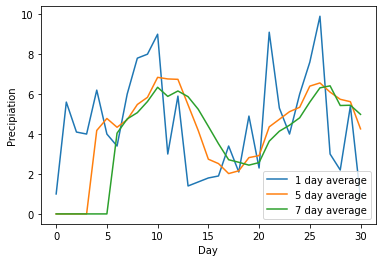

<center>
    
</center>

# Reading Files Python

Estimated time needed: **40** minutes

## Objectives

After completing this lab you will be able to:

-   Read text files using Python libraries


<h2>Table of Contents</h2>
<div class="alert alert-block alert-info" style="margin-top: 20px">
    <ul>
        <li><a href="download">Download Data</a></li>
        <li><a href="read">Reading Text Files</a></li>
        <li><a href="better">A Better Way to Open a File</a></li>
    </ul>
 
</div>

<hr>


<h2 id="download">Download Data</h2>


```python
import urllib.request
url = 'https://s3-api.us-geo.objectstorage.softlayer.net/cf-courses-data/CognitiveClass/PY0101EN/labs/example1.txt'
filename = 'Example1.txt'
urllib.request.urlretrieve(url, filename)
```


    ('Example1.txt', <http.client.HTTPMessage at 0x7f246890efd0>)


```python
# Download Example file


!wget -O /resources/data/Example1.txt https://s3-api.us-geo.objectstorage.softlayer.net/cf-courses-data/CognitiveClass/PY0101EN/labs/example1.txt
```

    --2021-09-25 12:08:19--  https://s3-api.us-geo.objectstorage.softlayer.net/cf-courses-data/CognitiveClass/PY0101EN/labs/example1.txt
    Resolving s3-api.us-geo.objectstorage.softlayer.net (s3-api.us-geo.objectstorage.softlayer.net)... 67.228.254.196
    Connecting to s3-api.us-geo.objectstorage.softlayer.net (s3-api.us-geo.objectstorage.softlayer.net)|67.228.254.196|:443... connected.
    HTTP request sent, awaiting response... 200 OK
    Length: 45 [text/plain]
    Saving to: ‘/resources/data/Example1.txt’
    
    /resources/data/Exa 100%[===================>]      45  --.-KB/s    in 0s      
    
    2021-09-25 12:08:19 (64.3 MB/s) - ‘/resources/data/Example1.txt’ saved [45/45]
    


```python

```

<hr>


<h2 id="read">Reading Text Files</h2>


One way to read or write a file in Python is to use the built-in <code>open</code> function. The <code>open</code> function provides a <b>File object</b> that contains the methods and attributes you need in order to read, save, and manipulate the file. In this notebook, we will only cover <b>.txt</b> files. The first parameter you need is the file path and the file name. An example is shown as follow:


 The mode argument is optional and the default value is <b>r</b>. In this notebook we only cover two modes: 

<ul>
    <li><b>r</b> Read mode for reading files </li>
    <li><b>w</b> Write mode for writing files</li>
</ul>


For the next example, we will use the text file <b>Example1.txt</b>. The file is shown as follow:


 We read the file: 


```python
# Read the Example1.txt

example1 = "Example1.txt"
file1 = open(example1, "r")
```

 We can view the attributes of the file.


The name of the file:


```python
# Print the path of file

file1.name
```


    'Example1.txt'


 The mode the file object is in:


```python
# Print the mode of file, either 'r' or 'w'

file1.mode
```


    'r'


We can read the file and assign it to a variable :


```python
# Read the file

FileContent = file1.read()
FileContent
```


    'This is line 1 \nThis is line 2\nThis is line 3'


The <b>/n</b> means that there is a new line. 


We can print the file: 


```python
# Print the file with '\n' as a new line

print(FileContent)
```

    This is line 1 
    This is line 2
    This is line 3


The file is of type string:


```python
# Type of file content

type(FileContent)
```


    str


It is very important that the file is closed in the end. This frees up resources and ensures consistency across different python versions.


```python
# Close file after finish

file1.close()
```

<hr>


<h2 id="better">A Better Way to Open a File</h2>


Using the <code>with</code> statement is better practice, it automatically closes the file even if the code encounters an exception. The code will run everything in the indent block then close the file object. 


```python
# Open file using with

with open(example1, "r") as file1:
    FileContent = file1.read()
    print(FileContent)
```

    This is line 1 
    This is line 2
    This is line 3


The file object is closed, you can verify it by running the following cell:  


```python
# Verify if the file is closed

file1.closed
```


    True


 We can see the info in the file:


```python
# See the content of file

print(FileContent)
```

    This is line 1 
    This is line 2
    This is line 3


The syntax is a little confusing as the file object is after the <code>as</code> statement. We also don’t explicitly close the file. Therefore we summarize the steps in a figure:


We don’t have to read the entire file, for example, we can read the first 4 characters by entering three as a parameter to the method **.read()**:


```python
# Read first four characters

with open(example1, "r") as file1:
    print(file1.read(4))
```

    This


Once the method <code>.read(4)</code> is called the first 4 characters are called. If we call the method again, the next 4 characters are called. The output for the following cell will demonstrate the process for different inputs to the method <code>read()</code>:


```python
# Read certain amount of characters

with open(example1, "r") as file1:
    print(file1.read(4))
    print(file1.read(4))
    print(file1.read(7))
    print(file1.read(15))
```

    This
     is 
    line 1 
    
    This is line 2


The process is illustrated in the below figure, and each color represents the part of the file read after the method <code>read()</code> is called:


 Here is an example using the same file, but instead we read 16, 5, and then 9 characters at a time: 


```python
# Read certain amount of characters

with open(example1, "r") as file1:
    print(file1.read(16))
    print(file1.read(5))
    print(file1.read(9))
```

    This is line 1 
    
    This 
    is line 2


We can also read one line of the file at a time using the method <code>readline()</code>: 


```python
# Read one line

with open(example1, "r") as file1:
    print("first line: " + file1.readline())
```

    first line: This is line 1 
    


We can also pass an argument to <code> readline() </code> to specify the number of charecters we want to read. However, unlike <code> read()</code>, <code> readline()</code> can only read one line at most.


```python
with open(example1, "r") as file1:
    print(file1.readline(20)) # does not read past the end of line
    print(file1.read(20)) # Returns the next 20 chars

```

    This is line 1 
    
    This is line 2
    This 


 We can use a loop to iterate through each line: 


```python
# Iterate through the lines

with open(example1,"r") as file1:
        i = 0;
        for line in file1:
            print("Iteration", str(i), ": ", line)
            i = i + 1
```

    Iteration 0 :  This is line 1 
    
    Iteration 1 :  This is line 2
    
    Iteration 2 :  This is line 3


We can use the method <code>readlines()</code> to save the text file to a list: 


```python
# Read all lines and save as a list

with open(example1, "r") as file1:
    FileasList = file1.readlines()
```

 Each element of the list corresponds to a line of text:


```python
# Print the first line

FileasList[0]
```


    'This is line 1 \n'


# Print the second line

FileasList[1]


```python
# Print the third line

FileasList[2]
```


    'This is line 3'


<hr>


<h2> Exercise </h2>


<h4>Weather Data</h4>


Your friend, a rising star in the field of meterology, has called on you to write a script to perform some analysis on weather station data. Given below is a file "resources/ex4.csv", which contains some precipiation data for the month of June.
Each line in the file has the format - Date,Precipation (upto two decimal places). Note how the data is seperated using ','. The first row of the file contains headers and should be ignored.

Your task is to complete the <code>getNAvg</code> function that computes a simple moving average for N days for the precipiation data, where N is a parameter. Your function should return a list of moving averages for the given data. 

The formula for a k day moving average over a series - $n_{0},n_{1},n_{2},n_{3}....n_{m}$is:
\begin{align}
M_{i} = M_{i-1} + \frac{n_{i} - n_{i-k}}{k}, \text{for i = k to m }
\\ \text{where $M_{i}$ is the moving average}
\end{align}
The skeleton code has been provided below. Edit only the required function.


<details><summary>Click here for the solution</summary>

```python
- Each line of the file has a '\n' char which should be removed
- The lines in the file are read as strings and need to be typecasted to floats
- For a k day moving average, The data points for the last k days must be known
    
```

</details>


```python
##Download the file 

!wget https://cf-courses-data.s3.us.cloud-object-storage.appdomain.cloud/IBMDeveloperSkillsNetwork-PY0101EN-SkillsNetwork/labs/Module%204/ex4.csv
```

    --2021-09-25 12:25:59--  https://cf-courses-data.s3.us.cloud-object-storage.appdomain.cloud/IBMDeveloperSkillsNetwork-PY0101EN-SkillsNetwork/labs/Module%204/ex4.csv
    Resolving cf-courses-data.s3.us.cloud-object-storage.appdomain.cloud (cf-courses-data.s3.us.cloud-object-storage.appdomain.cloud)... 169.63.118.104
    Connecting to cf-courses-data.s3.us.cloud-object-storage.appdomain.cloud (cf-courses-data.s3.us.cloud-object-storage.appdomain.cloud)|169.63.118.104|:443... connected.
    HTTP request sent, awaiting response... 200 OK
    Length: 718 [text/csv]
    Saving to: ‘ex4.csv.6’
    
    ex4.csv.6           100%[===================>]     718  --.-KB/s    in 0s      
    
    2021-09-25 12:25:59 (17.1 MB/s) - ‘ex4.csv.6’ saved [718/718]
    


```python
import matplotlib.pyplot as plt

statData ="ex4.csv"

def getNAvg(file,N):
    """
    file - File containting all the raw weather station data
    N - The number of days to compute the moving average over

    Return a list of containg the moving average of all data points
    """
    row = 0 # keep track of rows
    lastN = [] # keep track of last N points
    mean = [0] # running avg


    with open(file,"r") as rawData: 
        for line in rawData:
            if (row == 0): # Ignore the headers
                row = row + 1
                continue

            line = line.strip('\n')
            lineData = float(line.split(',')[1])

            if (row<=N): 
                lastN.append(lineData)
                mean[0] = (lineData + mean[0]*(row-1))/row
            else:
                mean.append( mean[row - N -1]+ (lineData - lastN[0])/N)
                lastN = lastN[1:]
                lastN.append(lineData)

            row = row +1            
        return mean

def plotData(mean,N):
        """ Plots running averages """
        mean = [round(x,3) for x in mean]
        plt.plot(mean,label=str(N) + ' day average')
        plt.xlabel('Day')
        plt.ylabel('Precipiation')
        plt.legend()


```

#### Once you have finished, you can you use the block below to plot your data


```python
plotData(getNAvg(statData,1),1)
plotData ([0 for x in range(1,5)]+ getNAvg(statData,5),5 )
plotData([0 for x in range(1,7)] + getNAvg(statData,7),7)
```





You can use the code below to verify your progress -


```python
avg5 =[4.18,4.78,4.34,4.72,5.48,5.84,6.84,6.76,6.74,5.46,4.18,2.74,2.52,2.02,2.16,2.82,2.92,4.36,4.74,5.12,5.34,6.4,6.56,6.1,5.74,5.62,4.26]
avg7 =[4.043,4.757,5.071,5.629,6.343,5.886,6.157,5.871,5.243,4.386,3.514,2.714,2.586,2.443,2.571,3.643,4.143,4.443,4.814,5.6,6.314,6.414,5.429,5.443,4.986]

def testMsg(passed):
    if passed:
       return 'Test Passed'
    else :
       return ' Test Failed'

print("getNAvg : ")
try:
    sol5 = getNAvg(statData,5)
    sol7 = getNAvg(statData,7)
    
    if(len(sol5)==len( avg5) and (len(sol7)==len(avg7))):
        err5 = sum([abs(avg5[index] - sol5[index])for index in range(len(avg5))])
        err7 = sum([abs(avg7[index] - sol7[index])for index in range(len(avg7))])
        print(testMsg((err5 < 1) and (err7 <1)))
        
    else:
        print(testMsg(False))
except NameError as e: 
    print('Error! Code: {c}, Message: {m}'.format(c = type(e).__name__, m = str(e)))
except:
    print("An error occured. Recheck your function")


```

    getNAvg : 
    Test Passed


<details><summary>Click here for the solution</summary>

```python
import matplotlib.pyplot as plt

statData ="ex4.csv"

def getNAvg(file,N):
    """
    file - File containting all the raw weather station data
    N - The number of days to compute the moving average over
    
    Return a list of containg the moving average of all data points
    """
    row = 0 # keep track of rows
    lastN = [] # keep track of last N points
    mean = [0] # running avg
    
    
    with open(file,"r") as rawData: 
        for line in rawData:
            if (row == 0): # Ignore the headers
                row = row + 1
                continue
            
            line = line.strip('\n')
            lineData = float(line.split(',')[1])
            
            if (row<=N): 
                lastN.append(lineData)
                mean[0] = (lineData + mean[0]*(row-1))/row
            else:
                mean.append( mean[row - N -1]+ (lineData - lastN[0])/N)
                lastN = lastN[1:]
                lastN.append(lineData)
            
            row = row +1            
        return mean
                    
def plotData(mean,N):
        """ Plots running averages """
        mean = [round(x,3) for x in mean]
        plt.plot(mean,label=str(N) + ' day average')
        plt.xlabel('Day')
        plt.ylabel('Precipiation')
        plt.legend()
       

        
plotData(getNAvg(statData,1),1)
plotData ([0 for x in range(1,5)]+ getNAvg(statData,5),5 )
plotData([0 for x in range(1,7)] + getNAvg(statData,7),7)

    
```

</details>


<div class="alert alert-success">
    Note: Files with sets of data seperated using ',' or other charecters are called '.csv' files.
    They are a very common way to store data. Usually when dealing with them, An external library is used that does the nitpicky tasks for you. In fact, There are numerous libraries for statistical functions to. You will learn about such libraries later in the course. 
</div>


<hr>
<h2>The last exercise!</h2>
<p>Congratulations, you have completed your first lesson and hands-on lab in Python. However, there is one more thing you need to do. The Data Science community encourages sharing work. The best way to share and showcase your work is to share it on GitHub. By sharing your notebook on GitHub you are not only building your reputation with fellow data scientists, but you can also show it off when applying for a job. Even though this was your first piece of work, it is never too early to start building good habits. So, please read and follow <a href="https://cognitiveclass.ai/blog/data-scientists-stand-out-by-sharing-your-notebooks/" target="_blank">this article</a> to learn how to share your work.
<hr>


## Author

<a href="https://www.linkedin.com/in/joseph-s-50398b136/" target="_blank">Joseph Santarcangelo</a>

## Other contributors

<a href="www.linkedin.com/in/jiahui-mavis-zhou-a4537814a">Mavis Zhou</a>

## Change Log

| Date (YYYY-MM-DD) | Version | Changed By    | Change Description                                        |
| ----------------- | ------- | ------------- | --------------------------------------------------------- |
| 2020-09-30        | 1.2     | Malika Singla | Weather Data dataset link added                           |
| 2020-09-30        | 1.1     | Arjun Swani   | Added exericse "Weather Data"                             |
| 2020-09-30        | 1.0     | Arjun Swani   | Added blurbs about closing files and read() vs readline() |
| 2020-08-26        | 0.2     | Lavanya       | Moved lab to course repo in GitLab                        |
|                   |         |               |                                                           |
|                   |         |               |                                                           |

<hr/>

## <h3 align="center"> © IBM Corporation 2020. All rights reserved. <h3/>


```python

```
