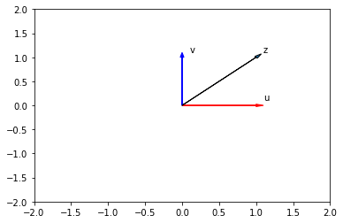
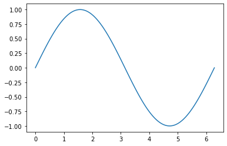
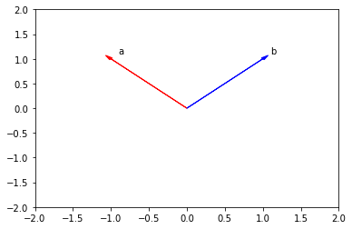
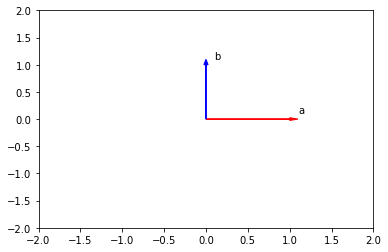
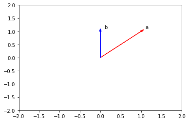

<center>
    
</center>

# 1D Numpy in Python

Estimated time needed: **30** minutes

## Objectives

After completing this lab you will be able to:

-   Import and use `numpy` library
-   Perform operations with `numpy`


<h2>Table of Contents</h2>
<div class="alert alert-block alert-info" style="margin-top: 20px">
    <ul>
        <li><a href="pre">Preparation</a></li>
        <li>
            <a href="numpy">What is Numpy?</a>
            <ul>
                <li><a href="type">Type</a></li>
                <li><a href="val">Assign Value</a></li>
                <li><a href="slice">Slicing</a></li>
                <li><a href="list">Assign Value with List</a></li>
                <li><a href="other">Other Attributes</a></li>
            </ul>
        </li>
        <li>
            <a href="op">Numpy Array Operations</a>
            <ul>
                <li><a href="add">Array Addition</a></li>
                <li><a href="multi">Array Multiplication</a></li>
                <li><a href="prod">Product of Two Numpy Arrays</a></li>
                <li><a href="dot">Dot Product</a></li>
                <li><a href="cons">Adding Constant to a Numpy Array</a></li>
            </ul>
        </li>
        <li><a href="math">Mathematical Functions</a></li>
        <li><a href="lin">Linspace</a></li>
    </ul>

</div>

<hr>


<h2 id="pre">Preparation</h2>


```python
# Import the libraries

import time 
import sys
import numpy as np 

import matplotlib.pyplot as plt
%matplotlib inline  
```


```python
# Plotting functions

def Plotvec1(u, z, v):
    
    ax = plt.axes()
    ax.arrow(0, 0, *u, head_width=0.05, color='r', head_length=0.1)
    plt.text(*(u + 0.1), 'u')
    
    ax.arrow(0, 0, *v, head_width=0.05, color='b', head_length=0.1)
    plt.text(*(v + 0.1), 'v')
    ax.arrow(0, 0, *z, head_width=0.05, head_length=0.1)
    plt.text(*(z + 0.1), 'z')
    plt.ylim(-2, 2)
    plt.xlim(-2, 2)

def Plotvec2(a,b):
    ax = plt.axes()
    ax.arrow(0, 0, *a, head_width=0.05, color ='r', head_length=0.1)
    plt.text(*(a + 0.1), 'a')
    ax.arrow(0, 0, *b, head_width=0.05, color ='b', head_length=0.1)
    plt.text(*(b + 0.1), 'b')
    plt.ylim(-2, 2)
    plt.xlim(-2, 2)
```

Create a Python List as follows:


```python
# Create a python list

a = ["0", 1, "two", "3", 4]
```

We can access the data via an index:


We can access each element using a square bracket as follows: 


```python
# Print each element

print("a[0]:", a[0])
print("a[1]:", a[1])
print("a[2]:", a[2])
print("a[3]:", a[3])
print("a[4]:", a[4])
```

    a[0]: 0
    a[1]: 1
    a[2]: two
    a[3]: 3
    a[4]: 4


<hr>


<h2 id="numpy">What is Numpy?</h2>


A numpy array is similar to a list. It's usually fixed in size and each element is of the same type. We can cast a list to a numpy array by first importing numpy: 


```python
# import numpy library

import numpy as np 
```

 We then cast the list as follows:


```python
# Create a numpy array

a = np.array([0, 1, 2, 3, 4])
a
```


    array([0, 1, 2, 3, 4])


Each element is of the same type, in this case integers: 


 As with lists, we can access each element via a square bracket:


```python
# Print each element

print("a[0]:", a[0])
print("a[1]:", a[1])
print("a[2]:", a[2])
print("a[3]:", a[3])
print("a[4]:", a[4])
```

    a[0]: 0
    a[1]: 1
    a[2]: 2
    a[3]: 3
    a[4]: 4


<h3 id="type">Type</h3>


If we check the type of the array we get <b>numpy.ndarray</b>:


```python
# Check the type of the array

type(a)
```


    numpy.ndarray


As numpy arrays contain data of the same type, we can use the attribute "dtype" to obtain the Data-type of the array’s elements. In this case a 64-bit integer: 


```python
# Check the type of the values stored in numpy array

a.dtype
```


    dtype('int64')


We can create a numpy array with real numbers:


```python
# Create a numpy array

b = np.array([3.1, 11.02, 6.2, 213.2, 5.2])
```

When we check the type of the array we get <b>numpy.ndarray</b>:


```python
# Check the type of array

type(b)
```


    numpy.ndarray


If we examine the attribute <code>dtype</code> we see float 64, as the elements are not integers: 


```python
# Check the value type

b.dtype
```


    dtype('float64')


<h3 id="val">Assign value</h3>


We can change the value of the array, consider the array <code>c</code>:


```python
# Create numpy array

c = np.array([20, 1, 2, 3, 4])
c
```


    array([20,  1,  2,  3,  4])


We can change the first element of the array to 100 as follows:


```python
# Assign the first element to 100

c[0] = 100
c
```


    array([100,   1,   2,   3,   4])


We can change the 5th element of the array to 0 as follows:


```python
# Assign the 5th element to 0

c[4] = 0
c
```


    array([100,   1,   2,   3,   0])


<h3 id="slice">Slicing</h3>


Like lists, we can slice the numpy array, and we can select the elements from 1 to 3 and assign it to a new numpy array <code>d</code> as follows:


```python
# Slicing the numpy array

d = c[1:4]
d
```


    array([1, 2, 3])


We can assign the corresponding indexes to  new values as follows: 


```python
# Set the fourth element and fifth element to 300 and 400

c[3:5] = 300, 400
c
```


    array([100,   1,   2, 300, 400])


<h3 id="list">Assign Value with List</h3>


Similarly, we can use a list to select a specific index.
The list ' select ' contains several values:


```python
# Create the index list

select = [0, 2, 3]
```

We can use the list as an argument in the brackets. The output is the elements corresponding to the particular index:


```python
# Use List to select elements

d = c[select]
d
```


    array([100,   2, 300])


We can assign the specified elements to a new value. For example, we can assign the values to 100 000 as follows:


```python
# Assign the specified elements to new value

c[select] = 100000
c
```


    array([100000,      1, 100000, 100000,    400])


<h3 id="other">Other Attributes</h3>


Let's review some basic array attributes using the array <code>a</code>:


```python
# Create a numpy array

a = np.array([0, 1, 2, 3, 4])
a
```


    array([0, 1, 2, 3, 4])


The attribute <code>size</code> is the number of elements in the array:


```python
# Get the size of numpy array

a.size
```


    5


The next two attributes will make more sense when we get to higher dimensions but let's review them. The attribute <code>ndim</code> represents the number of array dimensions or the rank of the array, in this case, one:


```python
# Get the number of dimensions of numpy array

a.ndim
```


    1


The attribute <code>shape</code> is a tuple of integers indicating the size of the array in each dimension:


```python
# Get the shape/size of numpy array

a.shape
```


    (5,)


```python
# Create a numpy array

a = np.array([1, -1, 1, -1])
```


```python
# Get the mean of numpy array

mean = a.mean()
mean
```


    0.0


```python
# Get the standard deviation of numpy array

standard_deviation=a.std()
standard_deviation
```


    1.0


```python
# Create a numpy array

b = np.array([-1, 2, 3, 4, 5])
b
```


    array([-1,  2,  3,  4,  5])


```python
# Get the biggest value in the numpy array

max_b = b.max()
max_b
```


    5


```python
# Get the smallest value in the numpy array

min_b = b.min()
min_b
```


    -1


<hr>


<h2 id="op">Numpy Array Operations</h2>


<h3 id="add">Array Addition</h3>


Consider the numpy array <code>u</code>:


```python
u = np.array([1, 0])
u
```


    array([1, 0])


Consider the numpy array <code>v</code>:


```python
v = np.array([0, 1])
v
```


    array([0, 1])


We can add the two arrays and assign it to z:


```python
# Numpy Array Addition

z = u + v
z
```


    array([1, 1])


 The operation is equivalent to vector addition:


```python
# Plot numpy arrays

Plotvec1(u, z, v)
```





<h3 id="multi">Array Multiplication</h3>


Consider the vector numpy array <code>y</code>:


```python
# Create a numpy array

y = np.array([1, 2])
y
```


    array([1, 2])


We can multiply every element in the array by 2:


```python
# Numpy Array Multiplication

z = 2 * y
z
```


    array([2, 4])


 This is equivalent to multiplying a vector by a scaler: 


<h3 id="prod">Product of Two Numpy Arrays</h3>


Consider the following array <code>u</code>:


```python
# Create a numpy array

u = np.array([1, 2])
u
```


    array([1, 2])


Consider the following array <code>v</code>:


```python
# Create a numpy array

v = np.array([3, 2])
v
```


    array([3, 2])


 The product of the two numpy arrays <code>u</code> and <code>v</code> is given by:


```python
# Calculate the production of two numpy arrays

z = u * v
z
```


    array([3, 4])


<h3 id="dot">Dot Product</h3>


The dot product of the two numpy arrays <code>u</code> and <code>v</code> is given by:


```python
# Calculate the dot product

np.dot(u, v)
```


    7


<h3 id="cons">Adding Constant to a Numpy Array</h3>


Consider the following array: 


```python
# Create a constant to numpy array

u = np.array([1, 2, 3, -1]) 
u
```


    array([ 1,  2,  3, -1])


Adding the constant 1 to each element in the array:


```python
# Add the constant to array

u + 1
```


    array([2, 3, 4, 0])


 The process is summarised in the following animation:


<hr>


<h2 id="math">Mathematical Functions</h2>


 We can access the value of <code>pi</code> in numpy as follows :


```python
# The value of pi

np.pi
```


    3.141592653589793


 We can create the following numpy array in Radians:


```python
# Create the numpy array in radians

x = np.array([0, np.pi/2 , np.pi])
```

We can apply the function <code>sin</code> to the array <code>x</code> and assign the values to the array <code>y</code>; this applies the sine function to each element in the array:  


```python
# Calculate the sin of each elements

y = np.sin(x)
y
```


    array([0.0000000e+00, 1.0000000e+00, 1.2246468e-16])


<hr>


<h2 id="lin">Linspace</h2>


 A useful function for plotting mathematical functions is <code>linspace</code>.   Linspace returns evenly spaced numbers over a specified interval. We specify the starting point of the sequence and the ending point of the sequence. The parameter "num" indicates the Number of samples to generate, in this case 5:


```python
# Makeup a numpy array within [-2, 2] and 5 elements

np.linspace(-2, 2, num=5)
```


    array([-2., -1.,  0.,  1.,  2.])


If we change the parameter <code>num</code> to 9, we get 9 evenly spaced numbers over the interval from -2 to 2: 


```python
# Makeup a numpy array within [-2, 2] and 9 elements

np.linspace(-2, 2, num=9)
```


    array([-2. , -1.5, -1. , -0.5,  0. ,  0.5,  1. ,  1.5,  2. ])


We can use the function <code>linspace</code> to generate 100 evenly spaced samples from the interval 0 to 2π: 


```python
# Makeup a numpy array within [0, 2π] and 100 elements 

x = np.linspace(0, 2*np.pi, num=100)
```

We can apply the sine function to each element in the array <code>x</code> and assign it to the array <code>y</code>: 


```python
# Calculate the sine of x list

y = np.sin(x)
```


```python
# Plot the result

plt.plot(x, y)
```


    [<matplotlib.lines.Line2D at 0x7fc295ad4ad0>]





<hr>


<h2 id="quiz">Quiz on 1D Numpy Array</h2>


Implement the following vector subtraction in numpy: u-v


```python
# Write your code below and press Shift+Enter to execute

u = np.array([1, 0])
v = np.array([0, 1])
u-v
```


    array([ 1, -1])


<hr>


Multiply the numpy array z with -2:


```python
# Write your code below and press Shift+Enter to execute

z = np.array([2, 4])
-2*z
```


    array([-4, -8])


<hr>


Consider the list <code>[1, 2, 3, 4, 5]</code> and <code>[1, 0, 1, 0, 1]</code>, and cast both lists to a numpy array then multiply them together:


```python
# Write your code below and press Shift+Enter to execute
u=np.array([1,2,3,4,5])
v=np.array([1,0,1,0,1])
u*v
```


    array([1, 0, 3, 0, 5])


<hr>


Convert the list <code>[-1, 1]</code> and <code>[1, 1]</code> to numpy arrays <code>a</code> and <code>b</code>.  Then, plot the arrays as vectors using the fuction <code>Plotvec2</code> and find the dot product:


```python
# Write your code below and press Shift+Enter to execute
a=np.array([-1,1])
b=np.array([1,1])
Plotvec2(a,b)
print("Dot Product : ",np.dot(a,b))
```

    Dot Product :  0





<hr>


Convert the list <code>[1, 0]</code> and <code>[0, 1]</code> to numpy arrays <code>a</code> and <code>b</code>. Then, plot the arrays as vectors using the function <code>Plotvec2</code> and find the dot product:


```python
# Write your code below and press Shift+Enter to execute
a=np.array([1,0])
b=np.array([0,1])
Plotvec2(a,b)
print("Dot Product : ",np.dot(a,b))
```

    Dot Product :  0





<hr>


Convert the list <code>[1, 1]</code> and <code>[0, 1]</code> to numpy arrays <code>a</code> and <code>b</code>. Then plot the arrays as vectors using the fuction <code>Plotvec2</code> and find the dot product:


```python
# Write your code below and press Shift+Enter to execute
a=np.array([1,1])
b=np.array([0,1])
Plotvec2(a,b)
print("Dot Product : ",np.dot(a,b))
```

    Dot Product :  1





<hr>


Why are the results of the dot product for <code>[-1, 1]</code> and <code>[1, 1]</code> and the dot product for <code>[1, 0]</code> and <code>[0, 1]</code> zero, but not zero for the dot product for <code>[1, 1]</code> and <code>[0, 1]</code>? <p><i>Hint: Study the corresponding figures, pay attention to the direction the arrows are pointing to.</i></p>


* Answer: The vectors used for first two questions are perpendicular to each other. As a result, the dot product is zero. 


<hr>
<h2>The last exercise!</h2>
<p>Congratulations, you have completed your first lesson and hands-on lab in Python. However, there is one more thing you need to do. The Data Science community encourages sharing work. The best way to share and showcase your work is to share it on GitHub. By sharing your notebook on GitHub you are not only building your reputation with fellow data scientists, but you can also show it off when applying for a job. Even though this was your first piece of work, it is never too early to start building good habits. So, please read and follow <a href="https://cognitiveclass.ai/blog/data-scientists-stand-out-by-sharing-your-notebooks/" target="_blank">this article</a> to learn how to share your work.
<hr>


## Author

<a href="https://www.linkedin.com/in/joseph-s-50398b136/" target="_blank">Joseph Santarcangelo</a>

## Other contributors

<a href="www.linkedin.com/in/jiahui-mavis-zhou-a4537814a">Mavis Zhou</a>

## Change Log

| Date (YYYY-MM-DD) | Version | Changed By | Change Description                 |
| ----------------- | ------- | ---------- | ---------------------------------- |
| 2020-08-26        | 2.0     | Lavanya    | Moved lab to course repo in GitLab |
|                   |         |            |                                    |
|                   |         |            |                                    |

<hr/>

## <h3 align="center"> © IBM Corporation 2020. All rights reserved. <h3/>

