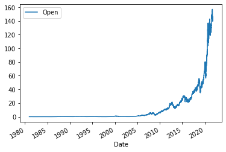
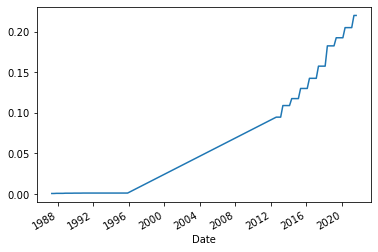

<center>
    
</center>


<h1>Extracting Stock Data Using a Python Library</h1>


A company's stock share is a piece of the company more precisely:

<p><b>A stock (also known as equity) is a security that represents the ownership of a fraction of a corporation. This
entitles the owner of the stock to a proportion of the corporation's assets and profits equal to how much stock they own. Units of stock are called "shares." [1]</p></b>

An investor can buy a stock and sell it later. If the stock price increases, the investor profits, If it decreases,the investor with incur a loss.  Determining the stock price is complex; it depends on the number of outstanding shares, the size of the company's future profits, and much more. People trade stocks throughout the day the stock ticker is a report of the price of a certain stock, updated continuously throughout the trading session by the various stock market exchanges. 

<p>You are a data scientist working for a hedge fund; it's your job to determine any suspicious stock activity. In this lab you will extract stock data using a Python library. We will use the <coode>yfinance</code> library, it allows us to extract data for stocks returning data in a pandas dataframe. You will use the lab to extract.</p>


<h2>Table of Contents</h2>
<div class="alert alert-block alert-info" style="margin-top: 20px">
    <ul>
        <li>Using yfinance to Extract Stock Info</li>
        <li>Using yfinance to Extract Historical Share Price Data</li>
        <li>Using yfinance to Extract Historical Dividends Data</li>
        <li>Exercise</li>
    </ul>
<p>
    Estimated Time Needed: <strong>30 min</strong></p>
</div>

<hr>


```python
!pip install yfinance
#!pip install pandas
```

    Collecting yfinance
      Downloading yfinance-0.1.63.tar.gz (26 kB)
    Requirement already satisfied: pandas>=0.24 in /home/jupyterlab/conda/envs/python/lib/python3.7/site-packages (from yfinance) (1.3.3)
    Requirement already satisfied: numpy>=1.15 in /home/jupyterlab/conda/envs/python/lib/python3.7/site-packages (from yfinance) (1.21.2)
    Requirement already satisfied: requests>=2.20 in /home/jupyterlab/conda/envs/python/lib/python3.7/site-packages (from yfinance) (2.26.0)
    Collecting multitasking>=0.0.7
      Downloading multitasking-0.0.9.tar.gz (8.1 kB)
    Requirement already satisfied: lxml>=4.5.1 in /home/jupyterlab/conda/envs/python/lib/python3.7/site-packages (from yfinance) (4.6.3)
    Requirement already satisfied: python-dateutil>=2.7.3 in /home/jupyterlab/conda/envs/python/lib/python3.7/site-packages (from pandas>=0.24->yfinance) (2.8.2)
    Requirement already satisfied: pytz>=2017.3 in /home/jupyterlab/conda/envs/python/lib/python3.7/site-packages (from pandas>=0.24->yfinance) (2021.1)
    Requirement already satisfied: six>=1.5 in /home/jupyterlab/conda/envs/python/lib/python3.7/site-packages (from python-dateutil>=2.7.3->pandas>=0.24->yfinance) (1.16.0)
    Requirement already satisfied: certifi>=2017.4.17 in /home/jupyterlab/conda/envs/python/lib/python3.7/site-packages (from requests>=2.20->yfinance) (2021.5.30)
    Requirement already satisfied: urllib3<1.27,>=1.21.1 in /home/jupyterlab/conda/envs/python/lib/python3.7/site-packages (from requests>=2.20->yfinance) (1.26.7)
    Requirement already satisfied: idna<4,>=2.5 in /home/jupyterlab/conda/envs/python/lib/python3.7/site-packages (from requests>=2.20->yfinance) (3.1)
    Requirement already satisfied: charset-normalizer~=2.0.0 in /home/jupyterlab/conda/envs/python/lib/python3.7/site-packages (from requests>=2.20->yfinance) (2.0.0)
    Building wheels for collected packages: yfinance, multitasking
      Building wheel for yfinance (setup.py) ... [?25ldone
    [?25h  Created wheel for yfinance: filename=yfinance-0.1.63-py2.py3-none-any.whl size=23918 sha256=3e1591eeac43ed4412e941cb2b3944b7358d6c1195d5f7a919adbe3074dff97e
      Stored in directory: /home/jupyterlab/.cache/pip/wheels/fe/87/8b/7ec24486e001d3926537f5f7801f57a74d181be25b11157983
      Building wheel for multitasking (setup.py) ... [?25ldone
    [?25h  Created wheel for multitasking: filename=multitasking-0.0.9-py3-none-any.whl size=8375 sha256=6b7cba7f53bf6cc62a44e4231649e17e633e8ca7acee31c3bac855975f0b3b54
      Stored in directory: /home/jupyterlab/.cache/pip/wheels/ae/25/47/4d68431a7ec1b6c4b5233365934b74c1d4e665bf5f968d363a
    Successfully built yfinance multitasking
    Installing collected packages: multitasking, yfinance
    Successfully installed multitasking-0.0.9 yfinance-0.1.63


```python
import yfinance as yf
import pandas as pd
```

## Using the yfinance Library to Extract Stock Data


Using the `Ticker` module we can create an object that will allow us to access functions to extract data. To do this we need to provide the ticker symbol for the stock, here the company is Apple and the ticker symbol is `AAPL`.


```python
apple = yf.Ticker("AAPL")
```

Now we can access functions and variables to extract the type of data we need. You can view them and what they represent here [https://aroussi.com/post/python-yahoo-finance](https://aroussi.com/post/python-yahoo-finance?cm_mmc=Email_Newsletter-_-Developer_Ed%2BTech-_-WW_WW-_-SkillsNetwork-Courses-IBMDeveloperSkillsNetwork-PY0220EN-SkillsNetwork-23455606&cm_mmca1=000026UJ&cm_mmca2=10006555&cm_mmca3=M12345678&cvosrc=email.Newsletter.M12345678&cvo_campaign=000026UJ&cm_mmc=Email_Newsletter-_-Developer_Ed%2BTech-_-WW_WW-_-SkillsNetwork-Courses-IBMDeveloperSkillsNetwork-PY0220EN-SkillsNetwork-23455606&cm_mmca1=000026UJ&cm_mmca2=10006555&cm_mmca3=M12345678&cvosrc=email.Newsletter.M12345678&cvo_campaign=000026UJ).


### Stock Info


Using the attribute  <code>info</code> we can extract information about the stock as a Python dictionary.


```python
apple_info=apple.info
apple_info
```


    {'zip': '95014',
     'sector': 'Technology',
     'fullTimeEmployees': 147000,
     'longBusinessSummary': 'Apple Inc. designs, manufactures, and markets smartphones, personal computers, tablets, wearables, and accessories worldwide. It also sells various related services. The company offers iPhone, a line of smartphones; Mac, a line of personal computers; iPad, a line of multi-purpose tablets; and wearables, home, and accessories comprising AirPods, Apple TV, Apple Watch, Beats products, HomePod, iPod touch, and other Apple-branded and third-party accessories. It also provides AppleCare support services; cloud services store services; and operates various platforms, including the App Store, that allow customers to discover and download applications and digital content, such as books, music, video, games, and podcasts. In addition, the company offers various services, such as Apple Arcade, a game subscription service; Apple Music, which offers users a curated listening experience with on-demand radio stations; Apple News+, a subscription news and magazine service; Apple TV+, which offers exclusive original content; Apple Card, a co-branded credit card; and Apple Pay, a cashless payment service, as well as licenses its intellectual property. The company serves consumers, and small and mid-sized businesses; and the education, enterprise, and government markets. It sells and delivers third-party applications for its products through the App Store. The company also sells its products through its retail and online stores, and direct sales force; and third-party cellular network carriers, wholesalers, retailers, and resellers. Apple Inc. was founded in 1977 and is headquartered in Cupertino, California.',
     'city': 'Cupertino',
     'phone': '408-996-1010',
     'state': 'CA',
     'country': 'United States',
     'companyOfficers': [],
     'website': 'http://www.apple.com',
     'maxAge': 1,
     'address1': 'One Apple Park Way',
     'industry': 'Consumer Electronics',
     'ebitdaMargins': 0.31955,
     'profitMargins': 0.25004,
     'grossMargins': 0.41005,
     'operatingCashflow': 104414003200,
     'revenueGrowth': 0.364,
     'operatingMargins': 0.28788,
     'ebitda': 110934999040,
     'targetLowPrice': 132,
     'recommendationKey': 'buy',
     'grossProfits': 104956000000,
     'freeCashflow': 80625876992,
     'targetMedianPrice': 169.64,
     'currentPrice': 143.29,
     'earningsGrowth': 1,
     'currentRatio': 1.062,
     'returnOnAssets': 0.19302,
     'numberOfAnalystOpinions': 42,
     'targetMeanPrice': 167.92,
     'debtToEquity': 210.782,
     'returnOnEquity': 1.27125,
     'targetHighPrice': 190,
     'totalCash': 61696000000,
     'totalDebt': 135491002368,
     'totalRevenue': 347155005440,
     'totalCashPerShare': 3.732,
     'financialCurrency': 'USD',
     'revenuePerShare': 20.61,
     'quickRatio': 0.887,
     'recommendationMean': 1.9,
     'exchange': 'NMS',
     'shortName': 'Apple Inc.',
     'longName': 'Apple Inc.',
     'exchangeTimezoneName': 'America/New_York',
     'exchangeTimezoneShortName': 'EDT',
     'isEsgPopulated': False,
     'gmtOffSetMilliseconds': '-14400000',
     'quoteType': 'EQUITY',
     'symbol': 'AAPL',
     'messageBoardId': 'finmb_24937',
     'market': 'us_market',
     'annualHoldingsTurnover': None,
     'enterpriseToRevenue': 7.035,
     'beta3Year': None,
     'enterpriseToEbitda': 22.017,
     '52WeekChange': 0.21398652,
     'morningStarRiskRating': None,
     'forwardEps': 5.68,
     'revenueQuarterlyGrowth': None,
     'sharesOutstanding': 16530199552,
     'fundInceptionDate': None,
     'annualReportExpenseRatio': None,
     'totalAssets': None,
     'bookValue': 3.882,
     'sharesShort': 100926641,
     'sharesPercentSharesOut': 0.0061000003,
     'fundFamily': None,
     'lastFiscalYearEnd': 1601078400,
     'heldPercentInstitutions': 0.5869,
     'netIncomeToCommon': 86801997824,
     'trailingEps': 5.108,
     'lastDividendValue': None,
     'SandP52WeekChange': 0.254925,
     'priceToBook': 36.911385,
     'heldPercentInsiders': 0.00071000005,
     'nextFiscalYearEnd': 1664150400,
     'yield': None,
     'mostRecentQuarter': 1624665600,
     'shortRatio': 1.28,
     'sharesShortPreviousMonthDate': 1628812800,
     'floatShares': 16512974627,
     'beta': 1.222222,
     'enterpriseValue': 2442402463744,
     'priceHint': 2,
     'threeYearAverageReturn': None,
     'lastSplitDate': None,
     'lastSplitFactor': None,
     'legalType': None,
     'lastDividendDate': None,
     'morningStarOverallRating': None,
     'earningsQuarterlyGrowth': 0.932,
     'priceToSalesTrailing12Months': 6.8229237,
     'dateShortInterest': 1631664000,
     'pegRatio': 1.38,
     'ytdReturn': None,
     'forwardPE': 25.227112,
     'lastCapGain': None,
     'shortPercentOfFloat': 0.0061000003,
     'sharesShortPriorMonth': 93105968,
     'impliedSharesOutstanding': None,
     'category': None,
     'fiveYearAverageReturn': None,
     'previousClose': 142,
     'regularMarketOpen': 143.06,
     'twoHundredDayAverage': 137.5631,
     'trailingAnnualDividendYield': 0.0058802813,
     'payoutRatio': 0.16309999,
     'volume24Hr': None,
     'regularMarketDayHigh': 144.215,
     'navPrice': None,
     'averageDailyVolume10Day': 89936042,
     'regularMarketPreviousClose': 142,
     'fiftyDayAverage': 147.73529,
     'trailingAnnualDividendRate': 0.835,
     'open': 143.06,
     'toCurrency': None,
     'averageVolume10days': 89936042,
     'expireDate': None,
     'algorithm': None,
     'dividendRate': 0.88,
     'exDividendDate': 1628208000,
     'circulatingSupply': None,
     'startDate': None,
     'regularMarketDayLow': 142.73,
     'currency': 'USD',
     'trailingPE': 28.052074,
     'regularMarketVolume': 61732656,
     'lastMarket': None,
     'maxSupply': None,
     'openInterest': None,
     'marketCap': 2368612073472,
     'volumeAllCurrencies': None,
     'strikePrice': None,
     'averageVolume': 81090600,
     'dayLow': 142.73,
     'ask': 0,
     'askSize': 2900,
     'volume': 61732656,
     'fiftyTwoWeekHigh': 157.26,
     'fromCurrency': None,
     'fiveYearAvgDividendYield': 1.24,
     'fiftyTwoWeekLow': 107.32,
     'bid': 0,
     'tradeable': False,
     'dividendYield': 0.0061000003,
     'bidSize': 900,
     'dayHigh': 144.215,
     'regularMarketPrice': 143.29,
     'logo_url': 'https://logo.clearbit.com/apple.com'}


We can get the <code>'country'</code> using the key country


```python
apple_info['country']
```


    'United States'


### Extracting Share Price


A share is the single smallest part of a company's stock  that you can buy, the prices of these shares fluctuate over time. Using the <code>history()</code> method we can get the share price of the stock over a certain period of time. Using the `period` parameter we can set how far back from the present to get data. The options for `period` are 1 day (1d), 5d, 1 month (1mo) , 3mo, 6mo, 1 year (1y), 2y, 5y, 10y, ytd, and max.


```python
apple_share_price_data = apple.history(period="max")
```

The format that the data is returned in is a Pandas DataFrame. With the `Date` as the index the share `Open`, `High`, `Low`, `Close`, `Volume`, and `Stock Splits` are given for each day.


```python
apple_share_price_data.tail()
```


<div>
<style scoped>
    .dataframe tbody tr th:only-of-type {
        vertical-align: middle;
    }

    .dataframe tbody tr th {
        vertical-align: top;
    }

    .dataframe thead th {
        text-align: right;
    }
</style>
<table border="1" class="dataframe">
  <thead>
    <tr style="text-align: right;">
      <th></th>
      <th>Open</th>
      <th>High</th>
      <th>Low</th>
      <th>Close</th>
      <th>Volume</th>
      <th>Dividends</th>
      <th>Stock Splits</th>
    </tr>
    <tr>
      <th>Date</th>
      <th></th>
      <th></th>
      <th></th>
      <th></th>
      <th></th>
      <th></th>
      <th></th>
    </tr>
  </thead>
  <tbody>
    <tr>
      <th>2021-10-01</th>
      <td>141.899994</td>
      <td>142.919998</td>
      <td>139.110001</td>
      <td>142.649994</td>
      <td>94639600</td>
      <td>0.0</td>
      <td>0.0</td>
    </tr>
    <tr>
      <th>2021-10-04</th>
      <td>141.759995</td>
      <td>142.210007</td>
      <td>138.270004</td>
      <td>139.139999</td>
      <td>98322000</td>
      <td>0.0</td>
      <td>0.0</td>
    </tr>
    <tr>
      <th>2021-10-05</th>
      <td>139.490005</td>
      <td>142.240005</td>
      <td>139.360001</td>
      <td>141.110001</td>
      <td>80861100</td>
      <td>0.0</td>
      <td>0.0</td>
    </tr>
    <tr>
      <th>2021-10-06</th>
      <td>139.470001</td>
      <td>142.149994</td>
      <td>138.369995</td>
      <td>142.000000</td>
      <td>83221100</td>
      <td>0.0</td>
      <td>0.0</td>
    </tr>
    <tr>
      <th>2021-10-07</th>
      <td>143.059998</td>
      <td>144.220001</td>
      <td>142.720001</td>
      <td>143.289993</td>
      <td>61627800</td>
      <td>0.0</td>
      <td>0.0</td>
    </tr>
  </tbody>
</table>
</div>


We can reset the index of the DataFrame with the `reset_index` function. We also set the `inplace` paramter to `True` so the change takes place to the DataFrame itself.


```python
apple_share_price_data.reset_index(inplace=True)
```

We can plot the `Open` price against the `Date`:


```python
apple_share_price_data.plot(x="Date", y="Open")
```


    <AxesSubplot:xlabel='Date'>





### Extracting Dividends


Dividends are the distribution of a companys profits to shareholders. In this case they are defined as an amount of money returned per share an investor owns. Using the variable `dividends` we can get a dataframe of the data. The period of the data is given by the period defined in the 'history` function.


```python
apple.dividends
```


    Date
    1987-05-11    0.000536
    1987-08-10    0.000536
    1987-11-17    0.000714
    1988-02-12    0.000714
    1988-05-16    0.000714
                    ...   
    2020-08-07    0.205000
    2020-11-06    0.205000
    2021-02-05    0.205000
    2021-05-07    0.220000
    2021-08-06    0.220000
    Name: Dividends, Length: 72, dtype: float64


We can plot the dividends overtime:


```python
apple.dividends.plot()
```


    <AxesSubplot:xlabel='Date'>





## Exercise


Now using the `Ticker` module create an object for AMD (Advanced Micro Devices) with the ticker symbol is `AMD` called; name the object <code>amd</code>.


```python
amd=yf.Ticker('AMD')
```

<b>Question 1</b> Use the key  <code>'country'</code> to find the country the stock belongs to, remember it as it will be a quiz question.


```python
amd_info=amd.info
amd_info
```


    {'zip': '95054',
     'sector': 'Technology',
     'fullTimeEmployees': 12600,
     'longBusinessSummary': 'Advanced Micro Devices, Inc. operates as a semiconductor company worldwide. The company operates in two segments, Computing and Graphics; and Enterprise, Embedded and Semi-Custom. Its products include x86 microprocessors as an accelerated processing unit, chipsets, discrete and integrated graphics processing units (GPUs), data center and professional GPUs, and development services; and server and embedded processors, and semi-custom System-on-Chip (SoC) products, development services, and technology for game consoles. The company provides x86 microprocessors for desktop PCs under the AMD Ryzen, AMD Ryzen PRO, Ryzen, Threadripper, AMD A-Series, AMD FX, AMD Athlon, AMD Athlon PRO, and AMD Pro A-Series processors brands; microprocessors for notebook and 2-in-1s under the AMD Ryzen, AMD A-Series, AMD Athlon, AMD Ryzen PRO, AMD Athlon PRO, and AMD Pro A-Series processors brands; microprocessors for servers under the AMD EPYC and AMD Opteron brands; and chipsets under the AMD trademark. It also offers discrete GPUs for desktop and notebook PCs under the AMD Radeon graphics and AMD Embedded Radeon brands; professional graphics products under the AMD Radeon Pro and AMD FirePro graphics brands; and Radeon Instinct and AMD Instinct accelerators for servers. In addition, the company provides embedded processor solutions under the AMD Opteron, AMD Athlon, AMD Geode, AMD Ryzen, AMD EPYC, AMD R-Series, and G-Series processors brands; and customer-specific solutions based on AMD CPU, GPU, and multi-media technologies, as well as semi-custom SoC products. It serves original equipment manufacturers, public cloud service providers, original design manufacturers, system integrators, independent distributors, online retailers, and add-in-board manufacturers through its direct sales force, independent distributors, and sales representatives. Advanced Micro Devices, Inc. was founded in 1969 and is headquartered in Santa Clara, California.',
     'city': 'Santa Clara',
     'phone': '408 749 4000',
     'state': 'CA',
     'country': 'United States',
     'companyOfficers': [],
     'website': 'http://www.amd.com',
     'maxAge': 1,
     'address1': '2485 Augustine Drive',
     'industry': 'Semiconductors',
     'ebitdaMargins': 0.21746999,
     'profitMargins': 0.25757,
     'grossMargins': 0.45712003,
     'operatingCashflow': 2743000064,
     'revenueGrowth': 0.993,
     'operatingMargins': 0.19018,
     'ebitda': 2900999936,
     'targetLowPrice': 90,
     'recommendationKey': 'buy',
     'grossProfits': 4347000000,
     'freeCashflow': 1889250048,
     'targetMedianPrice': 115,
     'currentPrice': 106.45,
     'earningsGrowth': 3.448,
     'currentRatio': 2.703,
     'returnOnAssets': 0.18358,
     'numberOfAnalystOpinions': 35,
     'targetMeanPrice': 118.59,
     'debtToEquity': 9.299,
     'returnOnEquity': 0.66268,
     'targetHighPrice': 172,
     'totalCash': 3792999936,
     'totalDebt': 657000000,
     'totalRevenue': 13340000256,
     'totalCashPerShare': 3.127,
     'financialCurrency': 'USD',
     'revenuePerShare': 11.071,
     'quickRatio': 2.012,
     'recommendationMean': 2.3,
     'exchange': 'NMS',
     'shortName': 'Advanced Micro Devices, Inc.',
     'longName': 'Advanced Micro Devices, Inc.',
     'exchangeTimezoneName': 'America/New_York',
     'exchangeTimezoneShortName': 'EDT',
     'isEsgPopulated': False,
     'gmtOffSetMilliseconds': '-14400000',
     'quoteType': 'EQUITY',
     'symbol': 'AMD',
     'messageBoardId': 'finmb_168864',
     'market': 'us_market',
     'annualHoldingsTurnover': None,
     'enterpriseToRevenue': 9.444,
     'beta3Year': None,
     'enterpriseToEbitda': 43.428,
     '52WeekChange': 0.24717212,
     'morningStarRiskRating': None,
     'forwardEps': 3.05,
     'revenueQuarterlyGrowth': None,
     'sharesOutstanding': 1212969984,
     'fundInceptionDate': None,
     'annualReportExpenseRatio': None,
     'totalAssets': None,
     'bookValue': 5.824,
     'sharesShort': 62659363,
     'sharesPercentSharesOut': 0.0517,
     'fundFamily': None,
     'lastFiscalYearEnd': 1608940800,
     'heldPercentInstitutions': 0.69654,
     'netIncomeToCommon': 3436000000,
     'trailingEps': 2.837,
     'lastDividendValue': None,
     'SandP52WeekChange': 0.254925,
     'priceToBook': 18.277815,
     'heldPercentInsiders': 0.0043099998,
     'nextFiscalYearEnd': 1672012800,
     'yield': None,
     'mostRecentQuarter': 1624665600,
     'shortRatio': 1.24,
     'sharesShortPreviousMonthDate': 1628812800,
     'floatShares': 1205808787,
     'beta': 1.997883,
     'enterpriseValue': 125984153600,
     'priceHint': 2,
     'threeYearAverageReturn': None,
     'lastSplitDate': None,
     'lastSplitFactor': None,
     'legalType': None,
     'lastDividendDate': None,
     'morningStarOverallRating': None,
     'earningsQuarterlyGrowth': 3.522,
     'priceToSalesTrailing12Months': 9.679209,
     'dateShortInterest': 1631664000,
     'pegRatio': 1.35,
     'ytdReturn': None,
     'forwardPE': 34.901638,
     'lastCapGain': None,
     'shortPercentOfFloat': 0.0519,
     'sharesShortPriorMonth': 70574877,
     'impliedSharesOutstanding': None,
     'category': None,
     'fiveYearAverageReturn': None,
     'previousClose': 103.64,
     'regularMarketOpen': 104.6,
     'twoHundredDayAverage': 91.09568,
     'trailingAnnualDividendYield': None,
     'payoutRatio': 0,
     'volume24Hr': None,
     'regularMarketDayHigh': 107.94,
     'navPrice': None,
     'averageDailyVolume10Day': 48323971,
     'regularMarketPreviousClose': 103.64,
     'fiftyDayAverage': 105.81353,
     'trailingAnnualDividendRate': None,
     'open': 104.6,
     'toCurrency': None,
     'averageVolume10days': 48323971,
     'expireDate': None,
     'algorithm': None,
     'dividendRate': None,
     'exDividendDate': 798940800,
     'circulatingSupply': None,
     'startDate': None,
     'regularMarketDayLow': 104.47,
     'currency': 'USD',
     'trailingPE': 37.52203,
     'regularMarketVolume': 41460019,
     'lastMarket': None,
     'maxSupply': None,
     'openInterest': None,
     'marketCap': 129120649216,
     'volumeAllCurrencies': None,
     'strikePrice': None,
     'averageVolume': 61739850,
     'dayLow': 104.47,
     'ask': 0,
     'askSize': 800,
     'volume': 41460019,
     'fiftyTwoWeekHigh': 122.49,
     'fromCurrency': None,
     'fiveYearAvgDividendYield': None,
     'fiftyTwoWeekLow': 72.5,
     'bid': 0,
     'tradeable': False,
     'dividendYield': None,
     'bidSize': 1300,
     'dayHigh': 107.94,
     'regularMarketPrice': 106.45,
     'logo_url': 'https://logo.clearbit.com/amd.com'}


<b>Question 2</b> Use the key  <code>'sector'</code> to find the sector the stock belongs to, remember it as it will be a quiz question.


```python
amd_info['country']
```


    'United States'


<b>Question 3</b> Find the max of the <code>Volume</code> column of AMD using the `history` function, set the <code>period</code> to max.


```python
amd_data=amd.history(period='max')
max_volume= amd_data['Volume'].max()
print(max_volume)
print(amd_info['sector'])
```

    325058400
    Technology


<h2>About the Authors:</h2> 

<a href="https://www.linkedin.com/in/joseph-s-50398b136/">Joseph Santarcangelo</a> has a PhD in Electrical Engineering, his research focused on using machine learning, signal processing, and computer vision to determine how videos impact human cognition. Joseph has been working for IBM since he completed his PhD.

Azim Hirjani


## Change Log

| Date (YYYY-MM-DD) | Version | Changed By    | Change Description        |
| ----------------- | ------- | ------------- | ------------------------- |
| 2020-11-10        | 1.1     | Malika Singla | Deleted the Optional part |
| 2020-08-27        | 1.0     | Malika Singla | Added lab to GitLab       |

<hr>

## <h3 align="center"> © IBM Corporation 2020. All rights reserved. <h3/>

<p>

