# Final Exam - Data Analysis with Python

### Question 1

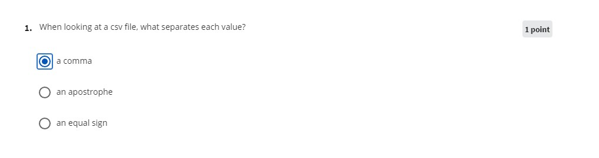

### Question 2

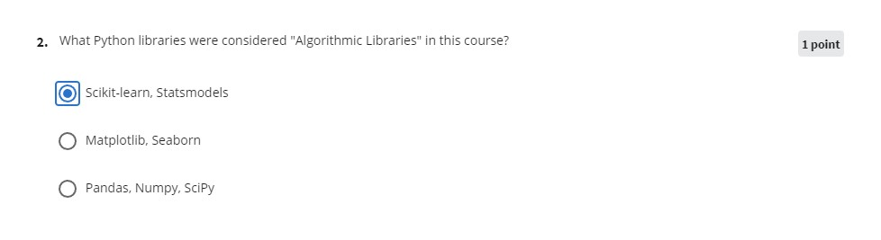

### Question 3

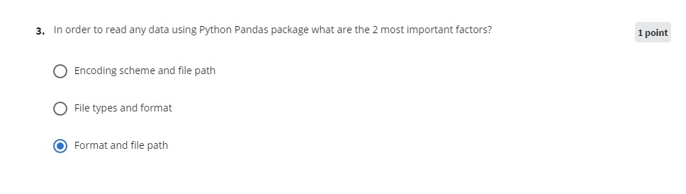

### Question 4

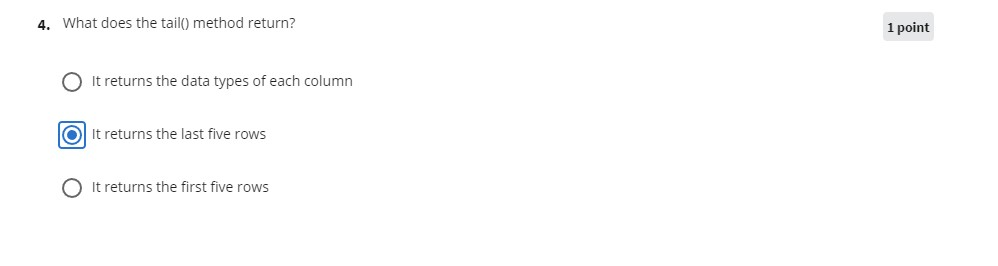

### Question 5

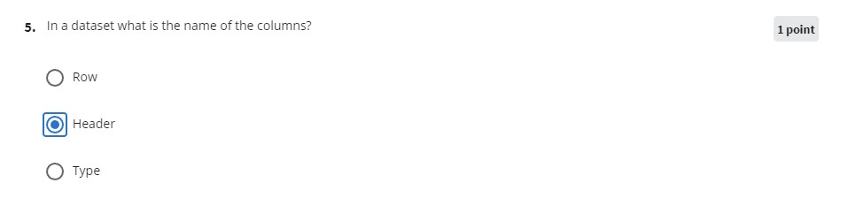

### Question 6

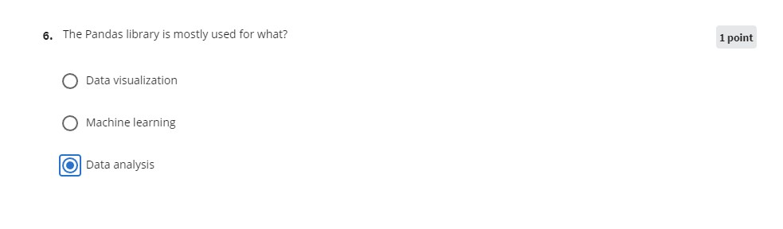

### Question 7

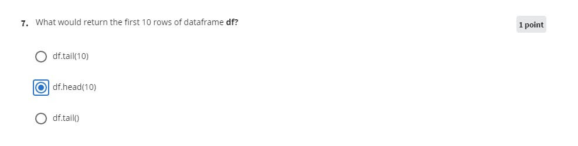

### Question 8

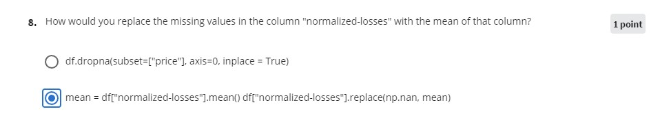

### Question 9

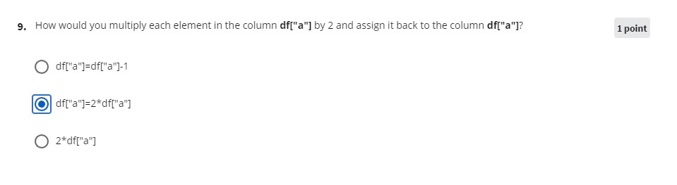

### Question 10

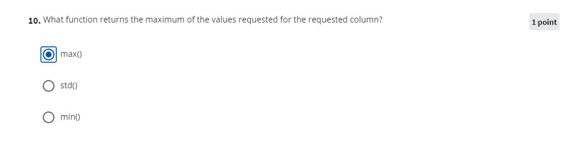

### Question 11

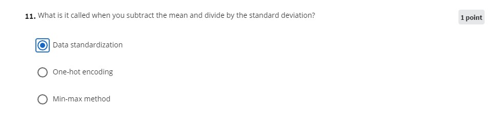

### Question 12

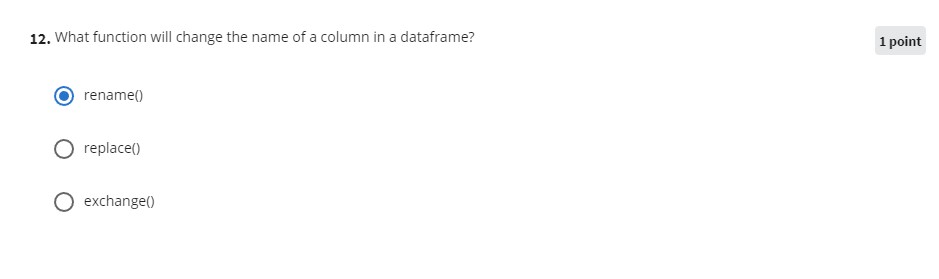