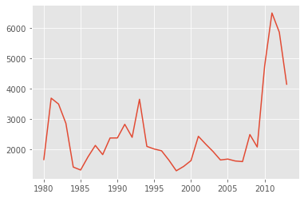
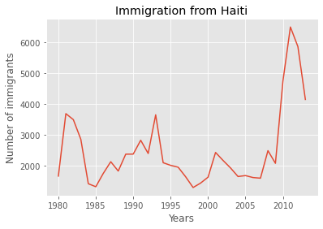
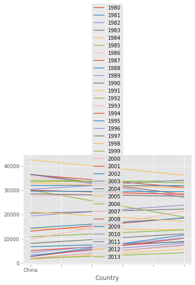
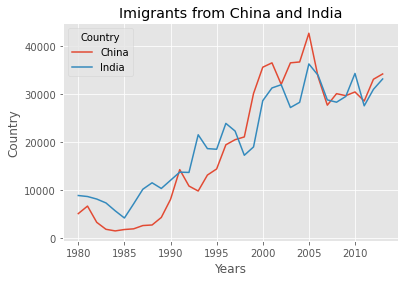
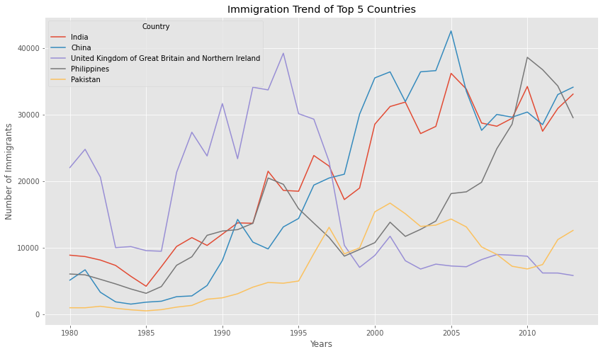

<center>
    
</center>

# Data Visualization

Estimated time needed: **30** minutes

## Objectives

After completing this lab you will be able to:

*   Create Data Visualization with Python
*   Use various Python libraries for visualization


## Introduction

The aim of these labs is to introduce you to data visualization with Python as concrete and as consistent as possible.
Speaking of consistency, because there is no *best* data visualization library available for Python - up to creating these labs - we have to introduce different libraries and show their benefits when we are discussing new visualization concepts. Doing so, we hope to make students well-rounded with visualization libraries and concepts so that they are able to judge and decide on the best visualization technique and tool for a given problem *and* audience.

Please make sure that you have completed the prerequisites for this course, namely [**Python Basics for Data Science**](https://www.edx.org/course/python-basics-for-data-science-2?utm_medium=Exinfluencer&utm_source=Exinfluencer&utm_content=000026UJ&utm_term=10006555&utm_id=NA-SkillsNetwork-Channel-SkillsNetworkCoursesIBMDeveloperSkillsNetworkDV0101ENSkillsNetwork20297740-2021-01-01) and [**Analyzing Data with Python**](https://www.edx.org/course/data-analysis-with-python?utm_medium=Exinfluencer&utm_source=Exinfluencer&utm_content=000026UJ&utm_term=10006555&utm_id=NA-SkillsNetwork-Channel-SkillsNetworkCoursesIBMDeveloperSkillsNetworkDV0101ENSkillsNetwork20297740-2021-01-01).

**Note**: The majority of the plots and visualizations will be generated using data stored in *pandas* dataframes. Therefore, in this lab, we provide a brief crash course on *pandas*. However, if you are interested in learning more about the *pandas* library, detailed description and explanation of how to use it and how to clean, munge, and process data stored in a *pandas* dataframe are provided in our course [**Analyzing Data with Python**](https://www.edx.org/course/data-analysis-with-python?utm_medium=Exinfluencer&utm_source=Exinfluencer&utm_content=000026UJ&utm_term=10006555&utm_id=NA-SkillsNetwork-Channel-SkillsNetworkCoursesIBMDeveloperSkillsNetworkDV0101ENSkillsNetwork20297740-2021-01-01).

***


## Table of Contents

<div class="alert alert-block alert-info" style="margin-top: 20px">

1.  [Exploring Datasets with *pandas*](#0)<br>

1.1 [The Dataset: Immigration to Canada from 1980 to 2013](#2)<br>
1.2 [*pandas* Basics](#4) <br>
1.3 [*pandas* Intermediate: Indexing and Selection](#6) <br>
2\. [Visualizing Data using Matplotlib](#8) <br>
2.1 [Matplotlib: Standard Python Visualization Library](#10) <br>
3\. [Line Plots](#12)

</div>


# Exploring Datasets with *pandas* <a id="0"></a>

*pandas* is an essential data analysis toolkit for Python. From their [website](http://pandas.pydata.org/?utm_medium=Exinfluencer&utm_source=Exinfluencer&utm_content=000026UJ&utm_term=10006555&utm_id=NA-SkillsNetwork-Channel-SkillsNetworkCoursesIBMDeveloperSkillsNetworkDV0101ENSkillsNetwork20297740-2021-01-01):

> *pandas* is a Python package providing fast, flexible, and expressive data structures designed to make working with “relational” or “labeled” data both easy and intuitive. It aims to be the fundamental high-level building block for doing practical, **real world** data analysis in Python.

The course heavily relies on *pandas* for data wrangling, analysis, and visualization. We encourage you to spend some time and familiarize yourself with the *pandas* API Reference: [http://pandas.pydata.org/pandas-docs/stable/api.html](http://pandas.pydata.org/pandas-docs/stable/api.html?utm_medium=Exinfluencer&utm_source=Exinfluencer&utm_content=000026UJ&utm_term=10006555&utm_id=NA-SkillsNetwork-Channel-SkillsNetworkCoursesIBMDeveloperSkillsNetworkDV0101ENSkillsNetwork20297740-2021-01-01).


## The Dataset: Immigration to Canada from 1980 to 2013 <a id="2"></a>


Dataset Source: [International migration flows to and from selected countries - The 2015 revision](http://www.un.org/en/development/desa/population/migration/data/empirical2/migrationflows.shtml?utm_medium=Exinfluencer&utm_source=Exinfluencer&utm_content=000026UJ&utm_term=10006555&utm_id=NA-SkillsNetwork-Channel-SkillsNetworkCoursesIBMDeveloperSkillsNetworkDV0101ENSkillsNetwork20297740-2021-01-01).

The dataset contains annual data on the flows of international immigrants as recorded by the countries of destination. The data presents both inflows and outflows according to the place of birth, citizenship or place of previous / next residence both for foreigners and nationals. The current version presents data pertaining to 45 countries.

In this lab, we will focus on the Canadian immigration data.


The Canada Immigration dataset can be fetched from <a href="https://cf-courses-data.s3.us.cloud-object-storage.appdomain.cloud/IBMDeveloperSkillsNetwork-DV0101EN-SkillsNetwork/Data%20Files/Canada.xlsx?utm_medium=Exinfluencer&utm_source=Exinfluencer&utm_content=000026UJ&utm_term=10006555&utm_id=NA-SkillsNetwork-Channel-SkillsNetworkCoursesIBMDeveloperSkillsNetworkDV0101ENSkillsNetwork20297740-2021-01-01">here</a>.

***


## *pandas* Basics<a id="4"></a>


The first thing we'll do is install **openpyxl** (formerly **xlrd**), a module that *pandas* requires to read Excel files.


```python
!mamba install openpyxl==3.0.9 -y
```

    'mamba' is not recognized as an internal or external command,
    operable program or batch file.


Next, we'll do is import two key data analysis modules: *pandas* and *numpy*.


```python
import numpy as np  # useful for many scientific computing in Python
import pandas as pd # primary data structure library
```

Let's download and import our primary Canadian Immigration dataset using *pandas*'s `read_excel()` method.


```python
df_can = pd.read_excel(
    'https://cf-courses-data.s3.us.cloud-object-storage.appdomain.cloud/IBMDeveloperSkillsNetwork-DV0101EN-SkillsNetwork/Data%20Files/Canada.xlsx',
    sheet_name='Canada by Citizenship',
    skiprows=range(20),
    skipfooter=2)

print('Data read into a pandas dataframe!')
```

    Data read into a pandas dataframe!


Let's view the top 5 rows of the dataset using the `head()` function.


```python
df_can.head()
# tip: You can specify the number of rows you'd like to see as follows: df_can.head(10) 
```


<div>
<style scoped>
    .dataframe tbody tr th:only-of-type {
        vertical-align: middle;
    }

    .dataframe tbody tr th {
        vertical-align: top;
    }

    .dataframe thead th {
        text-align: right;
    }
</style>
<table border="1" class="dataframe">
  <thead>
    <tr style="text-align: right;">
      <th></th>
      <th>Type</th>
      <th>Coverage</th>
      <th>OdName</th>
      <th>AREA</th>
      <th>AreaName</th>
      <th>REG</th>
      <th>RegName</th>
      <th>DEV</th>
      <th>DevName</th>
      <th>1980</th>
      <th>...</th>
      <th>2012</th>
      <th>2013</th>
      <th>Unnamed: 43</th>
      <th>Unnamed: 44</th>
      <th>Unnamed: 45</th>
      <th>Unnamed: 46</th>
      <th>Unnamed: 47</th>
      <th>Unnamed: 48</th>
      <th>Unnamed: 49</th>
      <th>Unnamed: 50</th>
    </tr>
  </thead>
  <tbody>
    <tr>
      <th>0</th>
      <td>Immigrants</td>
      <td>Foreigners</td>
      <td>Afghanistan</td>
      <td>935</td>
      <td>Asia</td>
      <td>5501</td>
      <td>Southern Asia</td>
      <td>902</td>
      <td>Developing regions</td>
      <td>16</td>
      <td>...</td>
      <td>2635</td>
      <td>2004</td>
      <td>NaN</td>
      <td>NaN</td>
      <td>NaN</td>
      <td>NaN</td>
      <td>NaN</td>
      <td>NaN</td>
      <td>NaN</td>
      <td>NaN</td>
    </tr>
    <tr>
      <th>1</th>
      <td>Immigrants</td>
      <td>Foreigners</td>
      <td>Albania</td>
      <td>908</td>
      <td>Europe</td>
      <td>925</td>
      <td>Southern Europe</td>
      <td>901</td>
      <td>Developed regions</td>
      <td>1</td>
      <td>...</td>
      <td>620</td>
      <td>603</td>
      <td>NaN</td>
      <td>NaN</td>
      <td>NaN</td>
      <td>NaN</td>
      <td>NaN</td>
      <td>NaN</td>
      <td>NaN</td>
      <td>NaN</td>
    </tr>
    <tr>
      <th>2</th>
      <td>Immigrants</td>
      <td>Foreigners</td>
      <td>Algeria</td>
      <td>903</td>
      <td>Africa</td>
      <td>912</td>
      <td>Northern Africa</td>
      <td>902</td>
      <td>Developing regions</td>
      <td>80</td>
      <td>...</td>
      <td>3774</td>
      <td>4331</td>
      <td>NaN</td>
      <td>NaN</td>
      <td>NaN</td>
      <td>NaN</td>
      <td>NaN</td>
      <td>NaN</td>
      <td>NaN</td>
      <td>NaN</td>
    </tr>
    <tr>
      <th>3</th>
      <td>Immigrants</td>
      <td>Foreigners</td>
      <td>American Samoa</td>
      <td>909</td>
      <td>Oceania</td>
      <td>957</td>
      <td>Polynesia</td>
      <td>902</td>
      <td>Developing regions</td>
      <td>0</td>
      <td>...</td>
      <td>0</td>
      <td>0</td>
      <td>NaN</td>
      <td>NaN</td>
      <td>NaN</td>
      <td>NaN</td>
      <td>NaN</td>
      <td>NaN</td>
      <td>NaN</td>
      <td>NaN</td>
    </tr>
    <tr>
      <th>4</th>
      <td>Immigrants</td>
      <td>Foreigners</td>
      <td>Andorra</td>
      <td>908</td>
      <td>Europe</td>
      <td>925</td>
      <td>Southern Europe</td>
      <td>901</td>
      <td>Developed regions</td>
      <td>0</td>
      <td>...</td>
      <td>1</td>
      <td>1</td>
      <td>NaN</td>
      <td>NaN</td>
      <td>NaN</td>
      <td>NaN</td>
      <td>NaN</td>
      <td>NaN</td>
      <td>NaN</td>
      <td>NaN</td>
    </tr>
  </tbody>
</table>
<p>5 rows × 51 columns</p>
</div>


We can also view the bottom 5 rows of the dataset using the `tail()` function.


```python
df_can.tail()
```


<div>
<style scoped>
    .dataframe tbody tr th:only-of-type {
        vertical-align: middle;
    }

    .dataframe tbody tr th {
        vertical-align: top;
    }

    .dataframe thead th {
        text-align: right;
    }
</style>
<table border="1" class="dataframe">
  <thead>
    <tr style="text-align: right;">
      <th></th>
      <th>Type</th>
      <th>Coverage</th>
      <th>Country</th>
      <th>AREA</th>
      <th>Continent</th>
      <th>REG</th>
      <th>Region</th>
      <th>DEV</th>
      <th>DevName</th>
      <th>1980</th>
      <th>...</th>
      <th>2012</th>
      <th>2013</th>
      <th>Unnamed: 43</th>
      <th>Unnamed: 44</th>
      <th>Unnamed: 45</th>
      <th>Unnamed: 46</th>
      <th>Unnamed: 47</th>
      <th>Unnamed: 48</th>
      <th>Unnamed: 49</th>
      <th>Unnamed: 50</th>
    </tr>
  </thead>
  <tbody>
    <tr>
      <th>190</th>
      <td>Immigrants</td>
      <td>Foreigners</td>
      <td>Viet Nam</td>
      <td>935</td>
      <td>Asia</td>
      <td>920</td>
      <td>South-Eastern Asia</td>
      <td>902</td>
      <td>Developing regions</td>
      <td>1191</td>
      <td>...</td>
      <td>1731</td>
      <td>2112</td>
      <td>NaN</td>
      <td>NaN</td>
      <td>NaN</td>
      <td>NaN</td>
      <td>NaN</td>
      <td>NaN</td>
      <td>NaN</td>
      <td>NaN</td>
    </tr>
    <tr>
      <th>191</th>
      <td>Immigrants</td>
      <td>Foreigners</td>
      <td>Western Sahara</td>
      <td>903</td>
      <td>Africa</td>
      <td>912</td>
      <td>Northern Africa</td>
      <td>902</td>
      <td>Developing regions</td>
      <td>0</td>
      <td>...</td>
      <td>0</td>
      <td>0</td>
      <td>NaN</td>
      <td>NaN</td>
      <td>NaN</td>
      <td>NaN</td>
      <td>NaN</td>
      <td>NaN</td>
      <td>NaN</td>
      <td>NaN</td>
    </tr>
    <tr>
      <th>192</th>
      <td>Immigrants</td>
      <td>Foreigners</td>
      <td>Yemen</td>
      <td>935</td>
      <td>Asia</td>
      <td>922</td>
      <td>Western Asia</td>
      <td>902</td>
      <td>Developing regions</td>
      <td>1</td>
      <td>...</td>
      <td>174</td>
      <td>217</td>
      <td>NaN</td>
      <td>NaN</td>
      <td>NaN</td>
      <td>NaN</td>
      <td>NaN</td>
      <td>NaN</td>
      <td>NaN</td>
      <td>NaN</td>
    </tr>
    <tr>
      <th>193</th>
      <td>Immigrants</td>
      <td>Foreigners</td>
      <td>Zambia</td>
      <td>903</td>
      <td>Africa</td>
      <td>910</td>
      <td>Eastern Africa</td>
      <td>902</td>
      <td>Developing regions</td>
      <td>11</td>
      <td>...</td>
      <td>46</td>
      <td>59</td>
      <td>NaN</td>
      <td>NaN</td>
      <td>NaN</td>
      <td>NaN</td>
      <td>NaN</td>
      <td>NaN</td>
      <td>NaN</td>
      <td>NaN</td>
    </tr>
    <tr>
      <th>194</th>
      <td>Immigrants</td>
      <td>Foreigners</td>
      <td>Zimbabwe</td>
      <td>903</td>
      <td>Africa</td>
      <td>910</td>
      <td>Eastern Africa</td>
      <td>902</td>
      <td>Developing regions</td>
      <td>72</td>
      <td>...</td>
      <td>437</td>
      <td>407</td>
      <td>NaN</td>
      <td>NaN</td>
      <td>NaN</td>
      <td>NaN</td>
      <td>NaN</td>
      <td>NaN</td>
      <td>NaN</td>
      <td>NaN</td>
    </tr>
  </tbody>
</table>
<p>5 rows × 51 columns</p>
</div>


When analyzing a dataset, it's always a good idea to start by getting basic information about your dataframe. We can do this by using the `info()` method.

This method can be used to get a short summary of the dataframe.


```python
df_can.info(verbose=False)
```

    <class 'pandas.core.frame.DataFrame'>
    RangeIndex: 195 entries, 0 to 194
    Columns: 51 entries, Type to Unnamed: 50
    dtypes: float64(8), int64(37), object(6)
    memory usage: 77.8+ KB


To get the list of column headers we can call upon the data frame's `columns` instance variable.


```python
df_can.columns
```


    Index([       'Type',    'Coverage',     'Country',        'AREA',
             'Continent',         'REG',      'Region',         'DEV',
               'DevName',          1980,          1981,          1982,
                    1983,          1984,          1985,          1986,
                    1987,          1988,          1989,          1990,
                    1991,          1992,          1993,          1994,
                    1995,          1996,          1997,          1998,
                    1999,          2000,          2001,          2002,
                    2003,          2004,          2005,          2006,
                    2007,          2008,          2009,          2010,
                    2011,          2012,          2013, 'Unnamed: 43',
           'Unnamed: 44', 'Unnamed: 45', 'Unnamed: 46', 'Unnamed: 47',
           'Unnamed: 48', 'Unnamed: 49', 'Unnamed: 50'],
          dtype='object')


Similarly, to get the list of indices we use the `.index` instance variables.


```python
df_can.index
```


    RangeIndex(start=0, stop=195, step=1)


Note: The default type of intance variables `index` and `columns` are **NOT** `list`.


```python
print(type(df_can.columns))
print(type(df_can.index))
```

    <class 'pandas.core.indexes.base.Index'>
    <class 'pandas.core.indexes.range.RangeIndex'>


To get the index and columns as lists, we can use the `tolist()` method.


```python
df_can.columns.tolist()
```


    ['Type',
     'Coverage',
     'Country',
     'AREA',
     'Continent',
     'REG',
     'Region',
     'DEV',
     'DevName',
     1980,
     1981,
     1982,
     1983,
     1984,
     1985,
     1986,
     1987,
     1988,
     1989,
     1990,
     1991,
     1992,
     1993,
     1994,
     1995,
     1996,
     1997,
     1998,
     1999,
     2000,
     2001,
     2002,
     2003,
     2004,
     2005,
     2006,
     2007,
     2008,
     2009,
     2010,
     2011,
     2012,
     2013,
     'Unnamed: 43',
     'Unnamed: 44',
     'Unnamed: 45',
     'Unnamed: 46',
     'Unnamed: 47',
     'Unnamed: 48',
     'Unnamed: 49',
     'Unnamed: 50']


```python
df_can.index.tolist()
```


    [0,
     1,
     2,
     3,
     4,
     5,
     6,
     7,
     8,
     9,
     10,
     11,
     12,
     13,
     14,
     15,
     16,
     17,
     18,
     19,
     20,
     21,
     22,
     23,
     24,
     25,
     26,
     27,
     28,
     29,
     30,
     31,
     32,
     33,
     34,
     35,
     36,
     37,
     38,
     39,
     40,
     41,
     42,
     43,
     44,
     45,
     46,
     47,
     48,
     49,
     50,
     51,
     52,
     53,
     54,
     55,
     56,
     57,
     58,
     59,
     60,
     61,
     62,
     63,
     64,
     65,
     66,
     67,
     68,
     69,
     70,
     71,
     72,
     73,
     74,
     75,
     76,
     77,
     78,
     79,
     80,
     81,
     82,
     83,
     84,
     85,
     86,
     87,
     88,
     89,
     90,
     91,
     92,
     93,
     94,
     95,
     96,
     97,
     98,
     99,
     100,
     101,
     102,
     103,
     104,
     105,
     106,
     107,
     108,
     109,
     110,
     111,
     112,
     113,
     114,
     115,
     116,
     117,
     118,
     119,
     120,
     121,
     122,
     123,
     124,
     125,
     126,
     127,
     128,
     129,
     130,
     131,
     132,
     133,
     134,
     135,
     136,
     137,
     138,
     139,
     140,
     141,
     142,
     143,
     144,
     145,
     146,
     147,
     148,
     149,
     150,
     151,
     152,
     153,
     154,
     155,
     156,
     157,
     158,
     159,
     160,
     161,
     162,
     163,
     164,
     165,
     166,
     167,
     168,
     169,
     170,
     171,
     172,
     173,
     174,
     175,
     176,
     177,
     178,
     179,
     180,
     181,
     182,
     183,
     184,
     185,
     186,
     187,
     188,
     189,
     190,
     191,
     192,
     193,
     194]


```python
print(type(df_can.columns.tolist()))
print(type(df_can.index.tolist()))
```

    <class 'list'>
    <class 'list'>


To view the dimensions of the dataframe, we use the `shape` instance variable of it.


```python
# size of dataframe (rows, columns)
df_can.shape    
```


    (195, 51)


**Note**: The main types stored in *pandas* objects are `float`, `int`, `bool`, `datetime64[ns]`, `datetime64[ns, tz]`, `timedelta[ns]`, `category`, and `object` (string). In addition, these dtypes have item sizes, e.g. `int64` and `int32`.


Let's clean the data set to remove a few unnecessary columns. We can use *pandas* `drop()` method as follows:


```python
# in pandas axis=0 represents rows (default) and axis=1 represents columns.
df_can.drop(['AREA','REG','DEV','Type','Coverage'], axis=1, inplace=True)
df_can.head(2)
```


<div>
<style scoped>
    .dataframe tbody tr th:only-of-type {
        vertical-align: middle;
    }

    .dataframe tbody tr th {
        vertical-align: top;
    }

    .dataframe thead th {
        text-align: right;
    }
</style>
<table border="1" class="dataframe">
  <thead>
    <tr style="text-align: right;">
      <th></th>
      <th>Country</th>
      <th>Continent</th>
      <th>Region</th>
      <th>DevName</th>
      <th>1980</th>
      <th>1981</th>
      <th>1982</th>
      <th>1983</th>
      <th>1984</th>
      <th>1985</th>
      <th>...</th>
      <th>2012</th>
      <th>2013</th>
      <th>Unnamed: 43</th>
      <th>Unnamed: 44</th>
      <th>Unnamed: 45</th>
      <th>Unnamed: 46</th>
      <th>Unnamed: 47</th>
      <th>Unnamed: 48</th>
      <th>Unnamed: 49</th>
      <th>Unnamed: 50</th>
    </tr>
  </thead>
  <tbody>
    <tr>
      <th>0</th>
      <td>Afghanistan</td>
      <td>Asia</td>
      <td>Southern Asia</td>
      <td>Developing regions</td>
      <td>16</td>
      <td>39</td>
      <td>39</td>
      <td>47</td>
      <td>71</td>
      <td>340</td>
      <td>...</td>
      <td>2635</td>
      <td>2004</td>
      <td>NaN</td>
      <td>NaN</td>
      <td>NaN</td>
      <td>NaN</td>
      <td>NaN</td>
      <td>NaN</td>
      <td>NaN</td>
      <td>NaN</td>
    </tr>
    <tr>
      <th>1</th>
      <td>Albania</td>
      <td>Europe</td>
      <td>Southern Europe</td>
      <td>Developed regions</td>
      <td>1</td>
      <td>0</td>
      <td>0</td>
      <td>0</td>
      <td>0</td>
      <td>0</td>
      <td>...</td>
      <td>620</td>
      <td>603</td>
      <td>NaN</td>
      <td>NaN</td>
      <td>NaN</td>
      <td>NaN</td>
      <td>NaN</td>
      <td>NaN</td>
      <td>NaN</td>
      <td>NaN</td>
    </tr>
  </tbody>
</table>
<p>2 rows × 46 columns</p>
</div>


Let's rename the columns so that they make sense. We can use `rename()` method by passing in a dictionary of old and new names as follows:


```python
df_can.rename(columns={'OdName':'Country', 'AreaName':'Continent', 'RegName':'Region'}, inplace=True)
df_can.columns
```


    Index([    'Country',   'Continent',      'Region',     'DevName',
                    1980,          1981,          1982,          1983,
                    1984,          1985,          1986,          1987,
                    1988,          1989,          1990,          1991,
                    1992,          1993,          1994,          1995,
                    1996,          1997,          1998,          1999,
                    2000,          2001,          2002,          2003,
                    2004,          2005,          2006,          2007,
                    2008,          2009,          2010,          2011,
                    2012,          2013, 'Unnamed: 43', 'Unnamed: 44',
           'Unnamed: 45', 'Unnamed: 46', 'Unnamed: 47', 'Unnamed: 48',
           'Unnamed: 49', 'Unnamed: 50'],
          dtype='object')


We will also add a 'Total' column that sums up the total immigrants by country over the entire period 1980 - 2013, as follows:


```python
df_can['Total'] = df_can.sum(axis=1)
```

We can check to see how many null objects we have in the dataset as follows:


```python
df_can.isnull().sum()
```


    Country          0
    Continent        0
    Region           0
    DevName          0
    1980             0
    1981             0
    1982             0
    1983             0
    1984             0
    1985             0
    1986             0
    1987             0
    1988             0
    1989             0
    1990             0
    1991             0
    1992             0
    1993             0
    1994             0
    1995             0
    1996             0
    1997             0
    1998             0
    1999             0
    2000             0
    2001             0
    2002             0
    2003             0
    2004             0
    2005             0
    2006             0
    2007             0
    2008             0
    2009             0
    2010             0
    2011             0
    2012             0
    2013             0
    Unnamed: 43    195
    Unnamed: 44    195
    Unnamed: 45    195
    Unnamed: 46    195
    Unnamed: 47    195
    Unnamed: 48    195
    Unnamed: 49    195
    Unnamed: 50    195
    Total            0
    dtype: int64


Finally, let's view a quick summary of each column in our dataframe using the `describe()` method.


```python
df_can.describe()
```


<div>
<style scoped>
    .dataframe tbody tr th:only-of-type {
        vertical-align: middle;
    }

    .dataframe tbody tr th {
        vertical-align: top;
    }

    .dataframe thead th {
        text-align: right;
    }
</style>
<table border="1" class="dataframe">
  <thead>
    <tr style="text-align: right;">
      <th></th>
      <th>1980</th>
      <th>1981</th>
      <th>1982</th>
      <th>1983</th>
      <th>1984</th>
      <th>1985</th>
      <th>1986</th>
      <th>1987</th>
      <th>1988</th>
      <th>1989</th>
      <th>...</th>
      <th>2013</th>
      <th>Unnamed: 43</th>
      <th>Unnamed: 44</th>
      <th>Unnamed: 45</th>
      <th>Unnamed: 46</th>
      <th>Unnamed: 47</th>
      <th>Unnamed: 48</th>
      <th>Unnamed: 49</th>
      <th>Unnamed: 50</th>
      <th>Total</th>
    </tr>
  </thead>
  <tbody>
    <tr>
      <th>count</th>
      <td>195.000000</td>
      <td>195.000000</td>
      <td>195.000000</td>
      <td>195.000000</td>
      <td>195.000000</td>
      <td>195.000000</td>
      <td>195.000000</td>
      <td>195.000000</td>
      <td>195.000000</td>
      <td>195.000000</td>
      <td>...</td>
      <td>195.000000</td>
      <td>0.0</td>
      <td>0.0</td>
      <td>0.0</td>
      <td>0.0</td>
      <td>0.0</td>
      <td>0.0</td>
      <td>0.0</td>
      <td>0.0</td>
      <td>195.000000</td>
    </tr>
    <tr>
      <th>mean</th>
      <td>508.394872</td>
      <td>566.989744</td>
      <td>534.723077</td>
      <td>387.435897</td>
      <td>376.497436</td>
      <td>358.861538</td>
      <td>441.271795</td>
      <td>691.133333</td>
      <td>714.389744</td>
      <td>843.241026</td>
      <td>...</td>
      <td>1320.702564</td>
      <td>NaN</td>
      <td>NaN</td>
      <td>NaN</td>
      <td>NaN</td>
      <td>NaN</td>
      <td>NaN</td>
      <td>NaN</td>
      <td>NaN</td>
      <td>32867.451282</td>
    </tr>
    <tr>
      <th>std</th>
      <td>1949.588546</td>
      <td>2152.643752</td>
      <td>1866.997511</td>
      <td>1204.333597</td>
      <td>1198.246371</td>
      <td>1079.309600</td>
      <td>1225.576630</td>
      <td>2109.205607</td>
      <td>2443.606788</td>
      <td>2555.048874</td>
      <td>...</td>
      <td>4237.951988</td>
      <td>NaN</td>
      <td>NaN</td>
      <td>NaN</td>
      <td>NaN</td>
      <td>NaN</td>
      <td>NaN</td>
      <td>NaN</td>
      <td>NaN</td>
      <td>91785.498686</td>
    </tr>
    <tr>
      <th>min</th>
      <td>0.000000</td>
      <td>0.000000</td>
      <td>0.000000</td>
      <td>0.000000</td>
      <td>0.000000</td>
      <td>0.000000</td>
      <td>0.000000</td>
      <td>0.000000</td>
      <td>0.000000</td>
      <td>0.000000</td>
      <td>...</td>
      <td>0.000000</td>
      <td>NaN</td>
      <td>NaN</td>
      <td>NaN</td>
      <td>NaN</td>
      <td>NaN</td>
      <td>NaN</td>
      <td>NaN</td>
      <td>NaN</td>
      <td>1.000000</td>
    </tr>
    <tr>
      <th>25%</th>
      <td>0.000000</td>
      <td>0.000000</td>
      <td>0.000000</td>
      <td>0.000000</td>
      <td>0.000000</td>
      <td>0.000000</td>
      <td>0.500000</td>
      <td>0.500000</td>
      <td>1.000000</td>
      <td>1.000000</td>
      <td>...</td>
      <td>45.000000</td>
      <td>NaN</td>
      <td>NaN</td>
      <td>NaN</td>
      <td>NaN</td>
      <td>NaN</td>
      <td>NaN</td>
      <td>NaN</td>
      <td>NaN</td>
      <td>952.000000</td>
    </tr>
    <tr>
      <th>50%</th>
      <td>13.000000</td>
      <td>10.000000</td>
      <td>11.000000</td>
      <td>12.000000</td>
      <td>13.000000</td>
      <td>17.000000</td>
      <td>18.000000</td>
      <td>26.000000</td>
      <td>34.000000</td>
      <td>44.000000</td>
      <td>...</td>
      <td>213.000000</td>
      <td>NaN</td>
      <td>NaN</td>
      <td>NaN</td>
      <td>NaN</td>
      <td>NaN</td>
      <td>NaN</td>
      <td>NaN</td>
      <td>NaN</td>
      <td>5018.000000</td>
    </tr>
    <tr>
      <th>75%</th>
      <td>251.500000</td>
      <td>295.500000</td>
      <td>275.000000</td>
      <td>173.000000</td>
      <td>181.000000</td>
      <td>197.000000</td>
      <td>254.000000</td>
      <td>434.000000</td>
      <td>409.000000</td>
      <td>508.500000</td>
      <td>...</td>
      <td>796.000000</td>
      <td>NaN</td>
      <td>NaN</td>
      <td>NaN</td>
      <td>NaN</td>
      <td>NaN</td>
      <td>NaN</td>
      <td>NaN</td>
      <td>NaN</td>
      <td>22239.500000</td>
    </tr>
    <tr>
      <th>max</th>
      <td>22045.000000</td>
      <td>24796.000000</td>
      <td>20620.000000</td>
      <td>10015.000000</td>
      <td>10170.000000</td>
      <td>9564.000000</td>
      <td>9470.000000</td>
      <td>21337.000000</td>
      <td>27359.000000</td>
      <td>23795.000000</td>
      <td>...</td>
      <td>34129.000000</td>
      <td>NaN</td>
      <td>NaN</td>
      <td>NaN</td>
      <td>NaN</td>
      <td>NaN</td>
      <td>NaN</td>
      <td>NaN</td>
      <td>NaN</td>
      <td>691904.000000</td>
    </tr>
  </tbody>
</table>
<p>8 rows × 43 columns</p>
</div>


***

## *pandas* Intermediate: Indexing and Selection (slicing)<a id="6"></a>


### Select Column

**There are two ways to filter on a column name:**

Method 1: Quick and easy, but only works if the column name does NOT have spaces or special characters.

```python
    df.column_name               # returns series
```

Method 2: More robust, and can filter on multiple columns.

```python
    df['column']                  # returns series
```

```python
    df[['column 1', 'column 2']]  # returns dataframe
```

***


Example: Let's try filtering on the list of countries ('Country').


```python
df_can.Country  # returns a series
```


    0         Afghanistan
    1             Albania
    2             Algeria
    3      American Samoa
    4             Andorra
                ...      
    190          Viet Nam
    191    Western Sahara
    192             Yemen
    193            Zambia
    194          Zimbabwe
    Name: Country, Length: 195, dtype: object


Let's try filtering on the list of countries ('Country') and the data for years: 1980 - 1985.


```python
df_can[['Country', 1980, 1981, 1982, 1983, 1984, 1985]] # returns a dataframe
# notice that 'Country' is string, and the years are integers. 
# for the sake of consistency, we will convert all column names to string later on.
```


<div>
<style scoped>
    .dataframe tbody tr th:only-of-type {
        vertical-align: middle;
    }

    .dataframe tbody tr th {
        vertical-align: top;
    }

    .dataframe thead th {
        text-align: right;
    }
</style>
<table border="1" class="dataframe">
  <thead>
    <tr style="text-align: right;">
      <th></th>
      <th>Country</th>
      <th>1980</th>
      <th>1981</th>
      <th>1982</th>
      <th>1983</th>
      <th>1984</th>
      <th>1985</th>
    </tr>
  </thead>
  <tbody>
    <tr>
      <th>0</th>
      <td>Afghanistan</td>
      <td>16</td>
      <td>39</td>
      <td>39</td>
      <td>47</td>
      <td>71</td>
      <td>340</td>
    </tr>
    <tr>
      <th>1</th>
      <td>Albania</td>
      <td>1</td>
      <td>0</td>
      <td>0</td>
      <td>0</td>
      <td>0</td>
      <td>0</td>
    </tr>
    <tr>
      <th>2</th>
      <td>Algeria</td>
      <td>80</td>
      <td>67</td>
      <td>71</td>
      <td>69</td>
      <td>63</td>
      <td>44</td>
    </tr>
    <tr>
      <th>3</th>
      <td>American Samoa</td>
      <td>0</td>
      <td>1</td>
      <td>0</td>
      <td>0</td>
      <td>0</td>
      <td>0</td>
    </tr>
    <tr>
      <th>4</th>
      <td>Andorra</td>
      <td>0</td>
      <td>0</td>
      <td>0</td>
      <td>0</td>
      <td>0</td>
      <td>0</td>
    </tr>
    <tr>
      <th>...</th>
      <td>...</td>
      <td>...</td>
      <td>...</td>
      <td>...</td>
      <td>...</td>
      <td>...</td>
      <td>...</td>
    </tr>
    <tr>
      <th>190</th>
      <td>Viet Nam</td>
      <td>1191</td>
      <td>1829</td>
      <td>2162</td>
      <td>3404</td>
      <td>7583</td>
      <td>5907</td>
    </tr>
    <tr>
      <th>191</th>
      <td>Western Sahara</td>
      <td>0</td>
      <td>0</td>
      <td>0</td>
      <td>0</td>
      <td>0</td>
      <td>0</td>
    </tr>
    <tr>
      <th>192</th>
      <td>Yemen</td>
      <td>1</td>
      <td>2</td>
      <td>1</td>
      <td>6</td>
      <td>0</td>
      <td>18</td>
    </tr>
    <tr>
      <th>193</th>
      <td>Zambia</td>
      <td>11</td>
      <td>17</td>
      <td>11</td>
      <td>7</td>
      <td>16</td>
      <td>9</td>
    </tr>
    <tr>
      <th>194</th>
      <td>Zimbabwe</td>
      <td>72</td>
      <td>114</td>
      <td>102</td>
      <td>44</td>
      <td>32</td>
      <td>29</td>
    </tr>
  </tbody>
</table>
<p>195 rows × 7 columns</p>
</div>


### Select Row

There are main 2 ways to select rows:

```python
    df.loc[label]    # filters by the labels of the index/column
    df.iloc[index]   # filters by the positions of the index/column
```


Before we proceed, notice that the default index of the dataset is a numeric range from 0 to 194. This makes it very difficult to do a query by a specific country. For example to search for data on Japan, we need to know the corresponding index value.

This can be fixed very easily by setting the 'Country' column as the index using `set_index()` method.


```python
df_can.set_index('Country', inplace=True)
# tip: The opposite of set is reset. So to reset the index, we can use df_can.reset_index()
```


```python
df_can.head(3)
```


<div>
<style scoped>
    .dataframe tbody tr th:only-of-type {
        vertical-align: middle;
    }

    .dataframe tbody tr th {
        vertical-align: top;
    }

    .dataframe thead th {
        text-align: right;
    }
</style>
<table border="1" class="dataframe">
  <thead>
    <tr style="text-align: right;">
      <th></th>
      <th>Continent</th>
      <th>Region</th>
      <th>DevName</th>
      <th>1980</th>
      <th>1981</th>
      <th>1982</th>
      <th>1983</th>
      <th>1984</th>
      <th>1985</th>
      <th>1986</th>
      <th>...</th>
      <th>2013</th>
      <th>Unnamed: 43</th>
      <th>Unnamed: 44</th>
      <th>Unnamed: 45</th>
      <th>Unnamed: 46</th>
      <th>Unnamed: 47</th>
      <th>Unnamed: 48</th>
      <th>Unnamed: 49</th>
      <th>Unnamed: 50</th>
      <th>Total</th>
    </tr>
    <tr>
      <th>Country</th>
      <th></th>
      <th></th>
      <th></th>
      <th></th>
      <th></th>
      <th></th>
      <th></th>
      <th></th>
      <th></th>
      <th></th>
      <th></th>
      <th></th>
      <th></th>
      <th></th>
      <th></th>
      <th></th>
      <th></th>
      <th></th>
      <th></th>
      <th></th>
      <th></th>
    </tr>
  </thead>
  <tbody>
    <tr>
      <th>Afghanistan</th>
      <td>Asia</td>
      <td>Southern Asia</td>
      <td>Developing regions</td>
      <td>16</td>
      <td>39</td>
      <td>39</td>
      <td>47</td>
      <td>71</td>
      <td>340</td>
      <td>496</td>
      <td>...</td>
      <td>2004</td>
      <td>NaN</td>
      <td>NaN</td>
      <td>NaN</td>
      <td>NaN</td>
      <td>NaN</td>
      <td>NaN</td>
      <td>NaN</td>
      <td>NaN</td>
      <td>58639.0</td>
    </tr>
    <tr>
      <th>Albania</th>
      <td>Europe</td>
      <td>Southern Europe</td>
      <td>Developed regions</td>
      <td>1</td>
      <td>0</td>
      <td>0</td>
      <td>0</td>
      <td>0</td>
      <td>0</td>
      <td>1</td>
      <td>...</td>
      <td>603</td>
      <td>NaN</td>
      <td>NaN</td>
      <td>NaN</td>
      <td>NaN</td>
      <td>NaN</td>
      <td>NaN</td>
      <td>NaN</td>
      <td>NaN</td>
      <td>15699.0</td>
    </tr>
    <tr>
      <th>Algeria</th>
      <td>Africa</td>
      <td>Northern Africa</td>
      <td>Developing regions</td>
      <td>80</td>
      <td>67</td>
      <td>71</td>
      <td>69</td>
      <td>63</td>
      <td>44</td>
      <td>69</td>
      <td>...</td>
      <td>4331</td>
      <td>NaN</td>
      <td>NaN</td>
      <td>NaN</td>
      <td>NaN</td>
      <td>NaN</td>
      <td>NaN</td>
      <td>NaN</td>
      <td>NaN</td>
      <td>69439.0</td>
    </tr>
  </tbody>
</table>
<p>3 rows × 46 columns</p>
</div>


```python
# optional: to remove the name of the index
#df_can.index.name = None
```

Example: Let's view the number of immigrants from Japan (row 87) for the following scenarios:
1\. The full row data (all columns)
2\. For year 2013
3\. For years 1980 to 1985


```python
# 1. the full row data (all columns)
df_can.loc['Japan']
```


    Continent                   Asia
    Region              Eastern Asia
    DevName        Developed regions
    1980                         701
    1981                         756
    1982                         598
    1983                         309
    1984                         246
    1985                         198
    1986                         248
    1987                         422
    1988                         324
    1989                         494
    1990                         379
    1991                         506
    1992                         605
    1993                         907
    1994                         956
    1995                         826
    1996                         994
    1997                         924
    1998                         897
    1999                        1083
    2000                        1010
    2001                        1092
    2002                         806
    2003                         817
    2004                         973
    2005                        1067
    2006                        1212
    2007                        1250
    2008                        1284
    2009                        1194
    2010                        1168
    2011                        1265
    2012                        1214
    2013                         982
    Unnamed: 43                  NaN
    Unnamed: 44                  NaN
    Unnamed: 45                  NaN
    Unnamed: 46                  NaN
    Unnamed: 47                  NaN
    Unnamed: 48                  NaN
    Unnamed: 49                  NaN
    Unnamed: 50                  NaN
    Total                    27707.0
    Name: Japan, dtype: object


```python
# alternate methods
df_can.iloc[87]
```


    Continent                   Asia
    Region              Eastern Asia
    DevName        Developed regions
    1980                         701
    1981                         756
    1982                         598
    1983                         309
    1984                         246
    1985                         198
    1986                         248
    1987                         422
    1988                         324
    1989                         494
    1990                         379
    1991                         506
    1992                         605
    1993                         907
    1994                         956
    1995                         826
    1996                         994
    1997                         924
    1998                         897
    1999                        1083
    2000                        1010
    2001                        1092
    2002                         806
    2003                         817
    2004                         973
    2005                        1067
    2006                        1212
    2007                        1250
    2008                        1284
    2009                        1194
    2010                        1168
    2011                        1265
    2012                        1214
    2013                         982
    Unnamed: 43                  NaN
    Unnamed: 44                  NaN
    Unnamed: 45                  NaN
    Unnamed: 46                  NaN
    Unnamed: 47                  NaN
    Unnamed: 48                  NaN
    Unnamed: 49                  NaN
    Unnamed: 50                  NaN
    Total                    27707.0
    Name: Japan, dtype: object


```python
df_can[df_can.index == 'Japan']
```


<div>
<style scoped>
    .dataframe tbody tr th:only-of-type {
        vertical-align: middle;
    }

    .dataframe tbody tr th {
        vertical-align: top;
    }

    .dataframe thead th {
        text-align: right;
    }
</style>
<table border="1" class="dataframe">
  <thead>
    <tr style="text-align: right;">
      <th></th>
      <th>Continent</th>
      <th>Region</th>
      <th>DevName</th>
      <th>1980</th>
      <th>1981</th>
      <th>1982</th>
      <th>1983</th>
      <th>1984</th>
      <th>1985</th>
      <th>1986</th>
      <th>...</th>
      <th>2013</th>
      <th>Unnamed: 43</th>
      <th>Unnamed: 44</th>
      <th>Unnamed: 45</th>
      <th>Unnamed: 46</th>
      <th>Unnamed: 47</th>
      <th>Unnamed: 48</th>
      <th>Unnamed: 49</th>
      <th>Unnamed: 50</th>
      <th>Total</th>
    </tr>
    <tr>
      <th>Country</th>
      <th></th>
      <th></th>
      <th></th>
      <th></th>
      <th></th>
      <th></th>
      <th></th>
      <th></th>
      <th></th>
      <th></th>
      <th></th>
      <th></th>
      <th></th>
      <th></th>
      <th></th>
      <th></th>
      <th></th>
      <th></th>
      <th></th>
      <th></th>
      <th></th>
    </tr>
  </thead>
  <tbody>
    <tr>
      <th>Japan</th>
      <td>Asia</td>
      <td>Eastern Asia</td>
      <td>Developed regions</td>
      <td>701</td>
      <td>756</td>
      <td>598</td>
      <td>309</td>
      <td>246</td>
      <td>198</td>
      <td>248</td>
      <td>...</td>
      <td>982</td>
      <td>NaN</td>
      <td>NaN</td>
      <td>NaN</td>
      <td>NaN</td>
      <td>NaN</td>
      <td>NaN</td>
      <td>NaN</td>
      <td>NaN</td>
      <td>27707.0</td>
    </tr>
  </tbody>
</table>
<p>1 rows × 46 columns</p>
</div>


```python
# 2. for year 2013
df_can.loc['Japan', 2013]
```


    982


```python
# alternate method
# year 2013 is the last column, with a positional index of 36
df_can.iloc[87, 36]
```


    982


```python
# 3. for years 1980 to 1985
df_can.loc['Japan', [1980, 1981, 1982, 1983, 1984, 1984]]
```


    1980    701
    1981    756
    1982    598
    1983    309
    1984    246
    1984    246
    Name: Japan, dtype: object


```python
# Alternative Method
df_can.iloc[87, [3, 4, 5, 6, 7, 8]]
```


    1980    701
    1981    756
    1982    598
    1983    309
    1984    246
    1985    198
    Name: Japan, dtype: object


Column names that are integers (such as the years) might introduce some confusion. For example, when we are referencing the year 2013, one might confuse that when the 2013th positional index.

To avoid this ambuigity, let's convert the column names into strings: '1980' to '2013'.


```python
df_can.columns = list(map(str, df_can.columns))
# [print (type(x)) for x in df_can.columns.values] #<-- uncomment to check type of column headers
```

Since we converted the years to string, let's declare a variable that will allow us to easily call upon the full range of years:


```python
# useful for plotting later on
years = list(map(str, range(1980, 2014)))
years
```


    ['1980',
     '1981',
     '1982',
     '1983',
     '1984',
     '1985',
     '1986',
     '1987',
     '1988',
     '1989',
     '1990',
     '1991',
     '1992',
     '1993',
     '1994',
     '1995',
     '1996',
     '1997',
     '1998',
     '1999',
     '2000',
     '2001',
     '2002',
     '2003',
     '2004',
     '2005',
     '2006',
     '2007',
     '2008',
     '2009',
     '2010',
     '2011',
     '2012',
     '2013']


### Filtering based on a criteria

To filter the dataframe based on a condition, we simply pass the condition as a boolean vector.

For example, Let's filter the dataframe to show the data on Asian countries (AreaName = Asia).


```python
# 1. create the condition boolean series
condition = df_can['Continent'] == 'Asia'
print(condition)
```

    Country
    Afghanistan        True
    Albania           False
    Algeria           False
    American Samoa    False
    Andorra           False
                      ...  
    Viet Nam           True
    Western Sahara    False
    Yemen              True
    Zambia            False
    Zimbabwe          False
    Name: Continent, Length: 195, dtype: bool


```python
# 2. pass this condition into the dataFrame
df_can[condition]
```


<div>
<style scoped>
    .dataframe tbody tr th:only-of-type {
        vertical-align: middle;
    }

    .dataframe tbody tr th {
        vertical-align: top;
    }

    .dataframe thead th {
        text-align: right;
    }
</style>
<table border="1" class="dataframe">
  <thead>
    <tr style="text-align: right;">
      <th></th>
      <th>Continent</th>
      <th>Region</th>
      <th>DevName</th>
      <th>1980</th>
      <th>1981</th>
      <th>1982</th>
      <th>1983</th>
      <th>1984</th>
      <th>1985</th>
      <th>1986</th>
      <th>...</th>
      <th>2013</th>
      <th>Unnamed: 43</th>
      <th>Unnamed: 44</th>
      <th>Unnamed: 45</th>
      <th>Unnamed: 46</th>
      <th>Unnamed: 47</th>
      <th>Unnamed: 48</th>
      <th>Unnamed: 49</th>
      <th>Unnamed: 50</th>
      <th>Total</th>
    </tr>
    <tr>
      <th>Country</th>
      <th></th>
      <th></th>
      <th></th>
      <th></th>
      <th></th>
      <th></th>
      <th></th>
      <th></th>
      <th></th>
      <th></th>
      <th></th>
      <th></th>
      <th></th>
      <th></th>
      <th></th>
      <th></th>
      <th></th>
      <th></th>
      <th></th>
      <th></th>
      <th></th>
    </tr>
  </thead>
  <tbody>
    <tr>
      <th>Afghanistan</th>
      <td>Asia</td>
      <td>Southern Asia</td>
      <td>Developing regions</td>
      <td>16</td>
      <td>39</td>
      <td>39</td>
      <td>47</td>
      <td>71</td>
      <td>340</td>
      <td>496</td>
      <td>...</td>
      <td>2004</td>
      <td>NaN</td>
      <td>NaN</td>
      <td>NaN</td>
      <td>NaN</td>
      <td>NaN</td>
      <td>NaN</td>
      <td>NaN</td>
      <td>NaN</td>
      <td>58639.0</td>
    </tr>
    <tr>
      <th>Armenia</th>
      <td>Asia</td>
      <td>Western Asia</td>
      <td>Developing regions</td>
      <td>0</td>
      <td>0</td>
      <td>0</td>
      <td>0</td>
      <td>0</td>
      <td>0</td>
      <td>0</td>
      <td>...</td>
      <td>207</td>
      <td>NaN</td>
      <td>NaN</td>
      <td>NaN</td>
      <td>NaN</td>
      <td>NaN</td>
      <td>NaN</td>
      <td>NaN</td>
      <td>NaN</td>
      <td>3310.0</td>
    </tr>
    <tr>
      <th>Azerbaijan</th>
      <td>Asia</td>
      <td>Western Asia</td>
      <td>Developing regions</td>
      <td>0</td>
      <td>0</td>
      <td>0</td>
      <td>0</td>
      <td>0</td>
      <td>0</td>
      <td>0</td>
      <td>...</td>
      <td>57</td>
      <td>NaN</td>
      <td>NaN</td>
      <td>NaN</td>
      <td>NaN</td>
      <td>NaN</td>
      <td>NaN</td>
      <td>NaN</td>
      <td>NaN</td>
      <td>2649.0</td>
    </tr>
    <tr>
      <th>Bahrain</th>
      <td>Asia</td>
      <td>Western Asia</td>
      <td>Developing regions</td>
      <td>0</td>
      <td>2</td>
      <td>1</td>
      <td>1</td>
      <td>1</td>
      <td>3</td>
      <td>0</td>
      <td>...</td>
      <td>32</td>
      <td>NaN</td>
      <td>NaN</td>
      <td>NaN</td>
      <td>NaN</td>
      <td>NaN</td>
      <td>NaN</td>
      <td>NaN</td>
      <td>NaN</td>
      <td>475.0</td>
    </tr>
    <tr>
      <th>Bangladesh</th>
      <td>Asia</td>
      <td>Southern Asia</td>
      <td>Developing regions</td>
      <td>83</td>
      <td>84</td>
      <td>86</td>
      <td>81</td>
      <td>98</td>
      <td>92</td>
      <td>486</td>
      <td>...</td>
      <td>3789</td>
      <td>NaN</td>
      <td>NaN</td>
      <td>NaN</td>
      <td>NaN</td>
      <td>NaN</td>
      <td>NaN</td>
      <td>NaN</td>
      <td>NaN</td>
      <td>65568.0</td>
    </tr>
    <tr>
      <th>Bhutan</th>
      <td>Asia</td>
      <td>Southern Asia</td>
      <td>Developing regions</td>
      <td>0</td>
      <td>0</td>
      <td>0</td>
      <td>0</td>
      <td>1</td>
      <td>0</td>
      <td>0</td>
      <td>...</td>
      <td>487</td>
      <td>NaN</td>
      <td>NaN</td>
      <td>NaN</td>
      <td>NaN</td>
      <td>NaN</td>
      <td>NaN</td>
      <td>NaN</td>
      <td>NaN</td>
      <td>5876.0</td>
    </tr>
    <tr>
      <th>Brunei Darussalam</th>
      <td>Asia</td>
      <td>South-Eastern Asia</td>
      <td>Developing regions</td>
      <td>79</td>
      <td>6</td>
      <td>8</td>
      <td>2</td>
      <td>2</td>
      <td>4</td>
      <td>12</td>
      <td>...</td>
      <td>6</td>
      <td>NaN</td>
      <td>NaN</td>
      <td>NaN</td>
      <td>NaN</td>
      <td>NaN</td>
      <td>NaN</td>
      <td>NaN</td>
      <td>NaN</td>
      <td>600.0</td>
    </tr>
    <tr>
      <th>Cambodia</th>
      <td>Asia</td>
      <td>South-Eastern Asia</td>
      <td>Developing regions</td>
      <td>12</td>
      <td>19</td>
      <td>26</td>
      <td>33</td>
      <td>10</td>
      <td>7</td>
      <td>8</td>
      <td>...</td>
      <td>288</td>
      <td>NaN</td>
      <td>NaN</td>
      <td>NaN</td>
      <td>NaN</td>
      <td>NaN</td>
      <td>NaN</td>
      <td>NaN</td>
      <td>NaN</td>
      <td>6538.0</td>
    </tr>
    <tr>
      <th>China</th>
      <td>Asia</td>
      <td>Eastern Asia</td>
      <td>Developing regions</td>
      <td>5123</td>
      <td>6682</td>
      <td>3308</td>
      <td>1863</td>
      <td>1527</td>
      <td>1816</td>
      <td>1960</td>
      <td>...</td>
      <td>34129</td>
      <td>NaN</td>
      <td>NaN</td>
      <td>NaN</td>
      <td>NaN</td>
      <td>NaN</td>
      <td>NaN</td>
      <td>NaN</td>
      <td>NaN</td>
      <td>659962.0</td>
    </tr>
    <tr>
      <th>China, Hong Kong Special Administrative Region</th>
      <td>Asia</td>
      <td>Eastern Asia</td>
      <td>Developing regions</td>
      <td>0</td>
      <td>0</td>
      <td>0</td>
      <td>0</td>
      <td>0</td>
      <td>0</td>
      <td>0</td>
      <td>...</td>
      <td>774</td>
      <td>NaN</td>
      <td>NaN</td>
      <td>NaN</td>
      <td>NaN</td>
      <td>NaN</td>
      <td>NaN</td>
      <td>NaN</td>
      <td>NaN</td>
      <td>9327.0</td>
    </tr>
    <tr>
      <th>China, Macao Special Administrative Region</th>
      <td>Asia</td>
      <td>Eastern Asia</td>
      <td>Developing regions</td>
      <td>0</td>
      <td>0</td>
      <td>0</td>
      <td>0</td>
      <td>0</td>
      <td>0</td>
      <td>0</td>
      <td>...</td>
      <td>29</td>
      <td>NaN</td>
      <td>NaN</td>
      <td>NaN</td>
      <td>NaN</td>
      <td>NaN</td>
      <td>NaN</td>
      <td>NaN</td>
      <td>NaN</td>
      <td>284.0</td>
    </tr>
    <tr>
      <th>Cyprus</th>
      <td>Asia</td>
      <td>Western Asia</td>
      <td>Developing regions</td>
      <td>132</td>
      <td>128</td>
      <td>84</td>
      <td>46</td>
      <td>46</td>
      <td>43</td>
      <td>48</td>
      <td>...</td>
      <td>16</td>
      <td>NaN</td>
      <td>NaN</td>
      <td>NaN</td>
      <td>NaN</td>
      <td>NaN</td>
      <td>NaN</td>
      <td>NaN</td>
      <td>NaN</td>
      <td>1126.0</td>
    </tr>
    <tr>
      <th>Democratic People's Republic of Korea</th>
      <td>Asia</td>
      <td>Eastern Asia</td>
      <td>Developing regions</td>
      <td>1</td>
      <td>1</td>
      <td>3</td>
      <td>1</td>
      <td>4</td>
      <td>3</td>
      <td>0</td>
      <td>...</td>
      <td>17</td>
      <td>NaN</td>
      <td>NaN</td>
      <td>NaN</td>
      <td>NaN</td>
      <td>NaN</td>
      <td>NaN</td>
      <td>NaN</td>
      <td>NaN</td>
      <td>388.0</td>
    </tr>
    <tr>
      <th>Georgia</th>
      <td>Asia</td>
      <td>Western Asia</td>
      <td>Developing regions</td>
      <td>0</td>
      <td>0</td>
      <td>0</td>
      <td>0</td>
      <td>0</td>
      <td>0</td>
      <td>0</td>
      <td>...</td>
      <td>125</td>
      <td>NaN</td>
      <td>NaN</td>
      <td>NaN</td>
      <td>NaN</td>
      <td>NaN</td>
      <td>NaN</td>
      <td>NaN</td>
      <td>NaN</td>
      <td>2068.0</td>
    </tr>
    <tr>
      <th>India</th>
      <td>Asia</td>
      <td>Southern Asia</td>
      <td>Developing regions</td>
      <td>8880</td>
      <td>8670</td>
      <td>8147</td>
      <td>7338</td>
      <td>5704</td>
      <td>4211</td>
      <td>7150</td>
      <td>...</td>
      <td>33087</td>
      <td>NaN</td>
      <td>NaN</td>
      <td>NaN</td>
      <td>NaN</td>
      <td>NaN</td>
      <td>NaN</td>
      <td>NaN</td>
      <td>NaN</td>
      <td>691904.0</td>
    </tr>
    <tr>
      <th>Indonesia</th>
      <td>Asia</td>
      <td>South-Eastern Asia</td>
      <td>Developing regions</td>
      <td>186</td>
      <td>178</td>
      <td>252</td>
      <td>115</td>
      <td>123</td>
      <td>100</td>
      <td>127</td>
      <td>...</td>
      <td>387</td>
      <td>NaN</td>
      <td>NaN</td>
      <td>NaN</td>
      <td>NaN</td>
      <td>NaN</td>
      <td>NaN</td>
      <td>NaN</td>
      <td>NaN</td>
      <td>13150.0</td>
    </tr>
    <tr>
      <th>Iran (Islamic Republic of)</th>
      <td>Asia</td>
      <td>Southern Asia</td>
      <td>Developing regions</td>
      <td>1172</td>
      <td>1429</td>
      <td>1822</td>
      <td>1592</td>
      <td>1977</td>
      <td>1648</td>
      <td>1794</td>
      <td>...</td>
      <td>11291</td>
      <td>NaN</td>
      <td>NaN</td>
      <td>NaN</td>
      <td>NaN</td>
      <td>NaN</td>
      <td>NaN</td>
      <td>NaN</td>
      <td>NaN</td>
      <td>175923.0</td>
    </tr>
    <tr>
      <th>Iraq</th>
      <td>Asia</td>
      <td>Western Asia</td>
      <td>Developing regions</td>
      <td>262</td>
      <td>245</td>
      <td>260</td>
      <td>380</td>
      <td>428</td>
      <td>231</td>
      <td>265</td>
      <td>...</td>
      <td>4918</td>
      <td>NaN</td>
      <td>NaN</td>
      <td>NaN</td>
      <td>NaN</td>
      <td>NaN</td>
      <td>NaN</td>
      <td>NaN</td>
      <td>NaN</td>
      <td>69789.0</td>
    </tr>
    <tr>
      <th>Israel</th>
      <td>Asia</td>
      <td>Western Asia</td>
      <td>Developing regions</td>
      <td>1403</td>
      <td>1711</td>
      <td>1334</td>
      <td>541</td>
      <td>446</td>
      <td>680</td>
      <td>1212</td>
      <td>...</td>
      <td>1945</td>
      <td>NaN</td>
      <td>NaN</td>
      <td>NaN</td>
      <td>NaN</td>
      <td>NaN</td>
      <td>NaN</td>
      <td>NaN</td>
      <td>NaN</td>
      <td>66508.0</td>
    </tr>
    <tr>
      <th>Japan</th>
      <td>Asia</td>
      <td>Eastern Asia</td>
      <td>Developed regions</td>
      <td>701</td>
      <td>756</td>
      <td>598</td>
      <td>309</td>
      <td>246</td>
      <td>198</td>
      <td>248</td>
      <td>...</td>
      <td>982</td>
      <td>NaN</td>
      <td>NaN</td>
      <td>NaN</td>
      <td>NaN</td>
      <td>NaN</td>
      <td>NaN</td>
      <td>NaN</td>
      <td>NaN</td>
      <td>27707.0</td>
    </tr>
    <tr>
      <th>Jordan</th>
      <td>Asia</td>
      <td>Western Asia</td>
      <td>Developing regions</td>
      <td>177</td>
      <td>160</td>
      <td>155</td>
      <td>113</td>
      <td>102</td>
      <td>179</td>
      <td>181</td>
      <td>...</td>
      <td>1255</td>
      <td>NaN</td>
      <td>NaN</td>
      <td>NaN</td>
      <td>NaN</td>
      <td>NaN</td>
      <td>NaN</td>
      <td>NaN</td>
      <td>NaN</td>
      <td>35406.0</td>
    </tr>
    <tr>
      <th>Kazakhstan</th>
      <td>Asia</td>
      <td>Central Asia</td>
      <td>Developing regions</td>
      <td>0</td>
      <td>0</td>
      <td>0</td>
      <td>0</td>
      <td>0</td>
      <td>0</td>
      <td>0</td>
      <td>...</td>
      <td>348</td>
      <td>NaN</td>
      <td>NaN</td>
      <td>NaN</td>
      <td>NaN</td>
      <td>NaN</td>
      <td>NaN</td>
      <td>NaN</td>
      <td>NaN</td>
      <td>8490.0</td>
    </tr>
    <tr>
      <th>Kuwait</th>
      <td>Asia</td>
      <td>Western Asia</td>
      <td>Developing regions</td>
      <td>1</td>
      <td>0</td>
      <td>8</td>
      <td>2</td>
      <td>1</td>
      <td>4</td>
      <td>4</td>
      <td>...</td>
      <td>48</td>
      <td>NaN</td>
      <td>NaN</td>
      <td>NaN</td>
      <td>NaN</td>
      <td>NaN</td>
      <td>NaN</td>
      <td>NaN</td>
      <td>NaN</td>
      <td>2025.0</td>
    </tr>
    <tr>
      <th>Kyrgyzstan</th>
      <td>Asia</td>
      <td>Central Asia</td>
      <td>Developing regions</td>
      <td>0</td>
      <td>0</td>
      <td>0</td>
      <td>0</td>
      <td>0</td>
      <td>0</td>
      <td>0</td>
      <td>...</td>
      <td>123</td>
      <td>NaN</td>
      <td>NaN</td>
      <td>NaN</td>
      <td>NaN</td>
      <td>NaN</td>
      <td>NaN</td>
      <td>NaN</td>
      <td>NaN</td>
      <td>2353.0</td>
    </tr>
    <tr>
      <th>Lao People's Democratic Republic</th>
      <td>Asia</td>
      <td>South-Eastern Asia</td>
      <td>Developing regions</td>
      <td>11</td>
      <td>6</td>
      <td>16</td>
      <td>16</td>
      <td>7</td>
      <td>17</td>
      <td>21</td>
      <td>...</td>
      <td>15</td>
      <td>NaN</td>
      <td>NaN</td>
      <td>NaN</td>
      <td>NaN</td>
      <td>NaN</td>
      <td>NaN</td>
      <td>NaN</td>
      <td>NaN</td>
      <td>1089.0</td>
    </tr>
    <tr>
      <th>Lebanon</th>
      <td>Asia</td>
      <td>Western Asia</td>
      <td>Developing regions</td>
      <td>1409</td>
      <td>1119</td>
      <td>1159</td>
      <td>789</td>
      <td>1253</td>
      <td>1683</td>
      <td>2576</td>
      <td>...</td>
      <td>2172</td>
      <td>NaN</td>
      <td>NaN</td>
      <td>NaN</td>
      <td>NaN</td>
      <td>NaN</td>
      <td>NaN</td>
      <td>NaN</td>
      <td>NaN</td>
      <td>115359.0</td>
    </tr>
    <tr>
      <th>Malaysia</th>
      <td>Asia</td>
      <td>South-Eastern Asia</td>
      <td>Developing regions</td>
      <td>786</td>
      <td>816</td>
      <td>813</td>
      <td>448</td>
      <td>384</td>
      <td>374</td>
      <td>425</td>
      <td>...</td>
      <td>204</td>
      <td>NaN</td>
      <td>NaN</td>
      <td>NaN</td>
      <td>NaN</td>
      <td>NaN</td>
      <td>NaN</td>
      <td>NaN</td>
      <td>NaN</td>
      <td>24417.0</td>
    </tr>
    <tr>
      <th>Maldives</th>
      <td>Asia</td>
      <td>Southern Asia</td>
      <td>Developing regions</td>
      <td>0</td>
      <td>0</td>
      <td>0</td>
      <td>1</td>
      <td>0</td>
      <td>0</td>
      <td>0</td>
      <td>...</td>
      <td>1</td>
      <td>NaN</td>
      <td>NaN</td>
      <td>NaN</td>
      <td>NaN</td>
      <td>NaN</td>
      <td>NaN</td>
      <td>NaN</td>
      <td>NaN</td>
      <td>30.0</td>
    </tr>
    <tr>
      <th>Mongolia</th>
      <td>Asia</td>
      <td>Eastern Asia</td>
      <td>Developing regions</td>
      <td>0</td>
      <td>0</td>
      <td>0</td>
      <td>0</td>
      <td>0</td>
      <td>0</td>
      <td>0</td>
      <td>...</td>
      <td>99</td>
      <td>NaN</td>
      <td>NaN</td>
      <td>NaN</td>
      <td>NaN</td>
      <td>NaN</td>
      <td>NaN</td>
      <td>NaN</td>
      <td>NaN</td>
      <td>952.0</td>
    </tr>
    <tr>
      <th>Myanmar</th>
      <td>Asia</td>
      <td>South-Eastern Asia</td>
      <td>Developing regions</td>
      <td>80</td>
      <td>62</td>
      <td>46</td>
      <td>31</td>
      <td>41</td>
      <td>23</td>
      <td>18</td>
      <td>...</td>
      <td>262</td>
      <td>NaN</td>
      <td>NaN</td>
      <td>NaN</td>
      <td>NaN</td>
      <td>NaN</td>
      <td>NaN</td>
      <td>NaN</td>
      <td>NaN</td>
      <td>9245.0</td>
    </tr>
    <tr>
      <th>Nepal</th>
      <td>Asia</td>
      <td>Southern Asia</td>
      <td>Developing regions</td>
      <td>1</td>
      <td>1</td>
      <td>6</td>
      <td>1</td>
      <td>2</td>
      <td>4</td>
      <td>13</td>
      <td>...</td>
      <td>1308</td>
      <td>NaN</td>
      <td>NaN</td>
      <td>NaN</td>
      <td>NaN</td>
      <td>NaN</td>
      <td>NaN</td>
      <td>NaN</td>
      <td>NaN</td>
      <td>10222.0</td>
    </tr>
    <tr>
      <th>Oman</th>
      <td>Asia</td>
      <td>Western Asia</td>
      <td>Developing regions</td>
      <td>0</td>
      <td>0</td>
      <td>0</td>
      <td>8</td>
      <td>0</td>
      <td>0</td>
      <td>0</td>
      <td>...</td>
      <td>11</td>
      <td>NaN</td>
      <td>NaN</td>
      <td>NaN</td>
      <td>NaN</td>
      <td>NaN</td>
      <td>NaN</td>
      <td>NaN</td>
      <td>NaN</td>
      <td>224.0</td>
    </tr>
    <tr>
      <th>Pakistan</th>
      <td>Asia</td>
      <td>Southern Asia</td>
      <td>Developing regions</td>
      <td>978</td>
      <td>972</td>
      <td>1201</td>
      <td>900</td>
      <td>668</td>
      <td>514</td>
      <td>691</td>
      <td>...</td>
      <td>12603</td>
      <td>NaN</td>
      <td>NaN</td>
      <td>NaN</td>
      <td>NaN</td>
      <td>NaN</td>
      <td>NaN</td>
      <td>NaN</td>
      <td>NaN</td>
      <td>241600.0</td>
    </tr>
    <tr>
      <th>Philippines</th>
      <td>Asia</td>
      <td>South-Eastern Asia</td>
      <td>Developing regions</td>
      <td>6051</td>
      <td>5921</td>
      <td>5249</td>
      <td>4562</td>
      <td>3801</td>
      <td>3150</td>
      <td>4166</td>
      <td>...</td>
      <td>29544</td>
      <td>NaN</td>
      <td>NaN</td>
      <td>NaN</td>
      <td>NaN</td>
      <td>NaN</td>
      <td>NaN</td>
      <td>NaN</td>
      <td>NaN</td>
      <td>511391.0</td>
    </tr>
    <tr>
      <th>Qatar</th>
      <td>Asia</td>
      <td>Western Asia</td>
      <td>Developing regions</td>
      <td>0</td>
      <td>0</td>
      <td>0</td>
      <td>0</td>
      <td>0</td>
      <td>0</td>
      <td>1</td>
      <td>...</td>
      <td>6</td>
      <td>NaN</td>
      <td>NaN</td>
      <td>NaN</td>
      <td>NaN</td>
      <td>NaN</td>
      <td>NaN</td>
      <td>NaN</td>
      <td>NaN</td>
      <td>157.0</td>
    </tr>
    <tr>
      <th>Republic of Korea</th>
      <td>Asia</td>
      <td>Eastern Asia</td>
      <td>Developing regions</td>
      <td>1011</td>
      <td>1456</td>
      <td>1572</td>
      <td>1081</td>
      <td>847</td>
      <td>962</td>
      <td>1208</td>
      <td>...</td>
      <td>4509</td>
      <td>NaN</td>
      <td>NaN</td>
      <td>NaN</td>
      <td>NaN</td>
      <td>NaN</td>
      <td>NaN</td>
      <td>NaN</td>
      <td>NaN</td>
      <td>142581.0</td>
    </tr>
    <tr>
      <th>Saudi Arabia</th>
      <td>Asia</td>
      <td>Western Asia</td>
      <td>Developing regions</td>
      <td>0</td>
      <td>0</td>
      <td>1</td>
      <td>4</td>
      <td>1</td>
      <td>2</td>
      <td>5</td>
      <td>...</td>
      <td>267</td>
      <td>NaN</td>
      <td>NaN</td>
      <td>NaN</td>
      <td>NaN</td>
      <td>NaN</td>
      <td>NaN</td>
      <td>NaN</td>
      <td>NaN</td>
      <td>3425.0</td>
    </tr>
    <tr>
      <th>Singapore</th>
      <td>Asia</td>
      <td>South-Eastern Asia</td>
      <td>Developing regions</td>
      <td>241</td>
      <td>301</td>
      <td>337</td>
      <td>169</td>
      <td>128</td>
      <td>139</td>
      <td>205</td>
      <td>...</td>
      <td>141</td>
      <td>NaN</td>
      <td>NaN</td>
      <td>NaN</td>
      <td>NaN</td>
      <td>NaN</td>
      <td>NaN</td>
      <td>NaN</td>
      <td>NaN</td>
      <td>14579.0</td>
    </tr>
    <tr>
      <th>Sri Lanka</th>
      <td>Asia</td>
      <td>Southern Asia</td>
      <td>Developing regions</td>
      <td>185</td>
      <td>371</td>
      <td>290</td>
      <td>197</td>
      <td>1086</td>
      <td>845</td>
      <td>1838</td>
      <td>...</td>
      <td>2394</td>
      <td>NaN</td>
      <td>NaN</td>
      <td>NaN</td>
      <td>NaN</td>
      <td>NaN</td>
      <td>NaN</td>
      <td>NaN</td>
      <td>NaN</td>
      <td>148358.0</td>
    </tr>
    <tr>
      <th>State of Palestine</th>
      <td>Asia</td>
      <td>Western Asia</td>
      <td>Developing regions</td>
      <td>0</td>
      <td>0</td>
      <td>0</td>
      <td>0</td>
      <td>0</td>
      <td>0</td>
      <td>0</td>
      <td>...</td>
      <td>462</td>
      <td>NaN</td>
      <td>NaN</td>
      <td>NaN</td>
      <td>NaN</td>
      <td>NaN</td>
      <td>NaN</td>
      <td>NaN</td>
      <td>NaN</td>
      <td>6512.0</td>
    </tr>
    <tr>
      <th>Syrian Arab Republic</th>
      <td>Asia</td>
      <td>Western Asia</td>
      <td>Developing regions</td>
      <td>315</td>
      <td>419</td>
      <td>409</td>
      <td>269</td>
      <td>264</td>
      <td>385</td>
      <td>493</td>
      <td>...</td>
      <td>1009</td>
      <td>NaN</td>
      <td>NaN</td>
      <td>NaN</td>
      <td>NaN</td>
      <td>NaN</td>
      <td>NaN</td>
      <td>NaN</td>
      <td>NaN</td>
      <td>31485.0</td>
    </tr>
    <tr>
      <th>Tajikistan</th>
      <td>Asia</td>
      <td>Central Asia</td>
      <td>Developing regions</td>
      <td>0</td>
      <td>0</td>
      <td>0</td>
      <td>0</td>
      <td>0</td>
      <td>0</td>
      <td>0</td>
      <td>...</td>
      <td>39</td>
      <td>NaN</td>
      <td>NaN</td>
      <td>NaN</td>
      <td>NaN</td>
      <td>NaN</td>
      <td>NaN</td>
      <td>NaN</td>
      <td>NaN</td>
      <td>503.0</td>
    </tr>
    <tr>
      <th>Thailand</th>
      <td>Asia</td>
      <td>South-Eastern Asia</td>
      <td>Developing regions</td>
      <td>56</td>
      <td>53</td>
      <td>113</td>
      <td>65</td>
      <td>82</td>
      <td>66</td>
      <td>78</td>
      <td>...</td>
      <td>400</td>
      <td>NaN</td>
      <td>NaN</td>
      <td>NaN</td>
      <td>NaN</td>
      <td>NaN</td>
      <td>NaN</td>
      <td>NaN</td>
      <td>NaN</td>
      <td>9174.0</td>
    </tr>
    <tr>
      <th>Turkey</th>
      <td>Asia</td>
      <td>Western Asia</td>
      <td>Developing regions</td>
      <td>481</td>
      <td>874</td>
      <td>706</td>
      <td>280</td>
      <td>338</td>
      <td>202</td>
      <td>257</td>
      <td>...</td>
      <td>729</td>
      <td>NaN</td>
      <td>NaN</td>
      <td>NaN</td>
      <td>NaN</td>
      <td>NaN</td>
      <td>NaN</td>
      <td>NaN</td>
      <td>NaN</td>
      <td>31781.0</td>
    </tr>
    <tr>
      <th>Turkmenistan</th>
      <td>Asia</td>
      <td>Central Asia</td>
      <td>Developing regions</td>
      <td>0</td>
      <td>0</td>
      <td>0</td>
      <td>0</td>
      <td>0</td>
      <td>0</td>
      <td>0</td>
      <td>...</td>
      <td>14</td>
      <td>NaN</td>
      <td>NaN</td>
      <td>NaN</td>
      <td>NaN</td>
      <td>NaN</td>
      <td>NaN</td>
      <td>NaN</td>
      <td>NaN</td>
      <td>310.0</td>
    </tr>
    <tr>
      <th>United Arab Emirates</th>
      <td>Asia</td>
      <td>Western Asia</td>
      <td>Developing regions</td>
      <td>0</td>
      <td>2</td>
      <td>2</td>
      <td>1</td>
      <td>2</td>
      <td>0</td>
      <td>5</td>
      <td>...</td>
      <td>46</td>
      <td>NaN</td>
      <td>NaN</td>
      <td>NaN</td>
      <td>NaN</td>
      <td>NaN</td>
      <td>NaN</td>
      <td>NaN</td>
      <td>NaN</td>
      <td>836.0</td>
    </tr>
    <tr>
      <th>Uzbekistan</th>
      <td>Asia</td>
      <td>Central Asia</td>
      <td>Developing regions</td>
      <td>0</td>
      <td>0</td>
      <td>0</td>
      <td>0</td>
      <td>0</td>
      <td>0</td>
      <td>0</td>
      <td>...</td>
      <td>167</td>
      <td>NaN</td>
      <td>NaN</td>
      <td>NaN</td>
      <td>NaN</td>
      <td>NaN</td>
      <td>NaN</td>
      <td>NaN</td>
      <td>NaN</td>
      <td>3368.0</td>
    </tr>
    <tr>
      <th>Viet Nam</th>
      <td>Asia</td>
      <td>South-Eastern Asia</td>
      <td>Developing regions</td>
      <td>1191</td>
      <td>1829</td>
      <td>2162</td>
      <td>3404</td>
      <td>7583</td>
      <td>5907</td>
      <td>2741</td>
      <td>...</td>
      <td>2112</td>
      <td>NaN</td>
      <td>NaN</td>
      <td>NaN</td>
      <td>NaN</td>
      <td>NaN</td>
      <td>NaN</td>
      <td>NaN</td>
      <td>NaN</td>
      <td>97146.0</td>
    </tr>
    <tr>
      <th>Yemen</th>
      <td>Asia</td>
      <td>Western Asia</td>
      <td>Developing regions</td>
      <td>1</td>
      <td>2</td>
      <td>1</td>
      <td>6</td>
      <td>0</td>
      <td>18</td>
      <td>7</td>
      <td>...</td>
      <td>217</td>
      <td>NaN</td>
      <td>NaN</td>
      <td>NaN</td>
      <td>NaN</td>
      <td>NaN</td>
      <td>NaN</td>
      <td>NaN</td>
      <td>NaN</td>
      <td>2985.0</td>
    </tr>
  </tbody>
</table>
<p>49 rows × 46 columns</p>
</div>


```python
# we can pass multiple criteria in the same line.
# let's filter for AreaNAme = Asia and RegName = Southern Asia

df_can[(df_can['Continent']=='Asia') & (df_can['Region']=='Southern Asia')]

# note: When using 'and' and 'or' operators, pandas requires we use '&' and '|' instead of 'and' and 'or'
# don't forget to enclose the two conditions in parentheses
```

Before we proceed: let's review the changes we have made to our dataframe.


```python
print('data dimensions:', df_can.shape)
print(df_can.columns)
df_can.head(2)
```

    data dimensions: (195, 46)
    Index(['Continent', 'Region', 'DevName', '1980', '1981', '1982', '1983',
           '1984', '1985', '1986', '1987', '1988', '1989', '1990', '1991', '1992',
           '1993', '1994', '1995', '1996', '1997', '1998', '1999', '2000', '2001',
           '2002', '2003', '2004', '2005', '2006', '2007', '2008', '2009', '2010',
           '2011', '2012', '2013', 'Unnamed: 43', 'Unnamed: 44', 'Unnamed: 45',
           'Unnamed: 46', 'Unnamed: 47', 'Unnamed: 48', 'Unnamed: 49',
           'Unnamed: 50', 'Total'],
          dtype='object')


<div>
<style scoped>
    .dataframe tbody tr th:only-of-type {
        vertical-align: middle;
    }

    .dataframe tbody tr th {
        vertical-align: top;
    }

    .dataframe thead th {
        text-align: right;
    }
</style>
<table border="1" class="dataframe">
  <thead>
    <tr style="text-align: right;">
      <th></th>
      <th>Continent</th>
      <th>Region</th>
      <th>DevName</th>
      <th>1980</th>
      <th>1981</th>
      <th>1982</th>
      <th>1983</th>
      <th>1984</th>
      <th>1985</th>
      <th>1986</th>
      <th>...</th>
      <th>2013</th>
      <th>Unnamed: 43</th>
      <th>Unnamed: 44</th>
      <th>Unnamed: 45</th>
      <th>Unnamed: 46</th>
      <th>Unnamed: 47</th>
      <th>Unnamed: 48</th>
      <th>Unnamed: 49</th>
      <th>Unnamed: 50</th>
      <th>Total</th>
    </tr>
    <tr>
      <th>Country</th>
      <th></th>
      <th></th>
      <th></th>
      <th></th>
      <th></th>
      <th></th>
      <th></th>
      <th></th>
      <th></th>
      <th></th>
      <th></th>
      <th></th>
      <th></th>
      <th></th>
      <th></th>
      <th></th>
      <th></th>
      <th></th>
      <th></th>
      <th></th>
      <th></th>
    </tr>
  </thead>
  <tbody>
    <tr>
      <th>Afghanistan</th>
      <td>Asia</td>
      <td>Southern Asia</td>
      <td>Developing regions</td>
      <td>16</td>
      <td>39</td>
      <td>39</td>
      <td>47</td>
      <td>71</td>
      <td>340</td>
      <td>496</td>
      <td>...</td>
      <td>2004</td>
      <td>NaN</td>
      <td>NaN</td>
      <td>NaN</td>
      <td>NaN</td>
      <td>NaN</td>
      <td>NaN</td>
      <td>NaN</td>
      <td>NaN</td>
      <td>58639.0</td>
    </tr>
    <tr>
      <th>Albania</th>
      <td>Europe</td>
      <td>Southern Europe</td>
      <td>Developed regions</td>
      <td>1</td>
      <td>0</td>
      <td>0</td>
      <td>0</td>
      <td>0</td>
      <td>0</td>
      <td>1</td>
      <td>...</td>
      <td>603</td>
      <td>NaN</td>
      <td>NaN</td>
      <td>NaN</td>
      <td>NaN</td>
      <td>NaN</td>
      <td>NaN</td>
      <td>NaN</td>
      <td>NaN</td>
      <td>15699.0</td>
    </tr>
  </tbody>
</table>
<p>2 rows × 46 columns</p>
</div>


***

# Visualizing Data using Matplotlib<a id="8"></a>


## Matplotlib: Standard Python Visualization Library<a id="10"></a>

The primary plotting library we will explore in the course is [Matplotlib](http://matplotlib.org/?utm_medium=Exinfluencer&utm_source=Exinfluencer&utm_content=000026UJ&utm_term=10006555&utm_id=NA-SkillsNetwork-Channel-SkillsNetworkCoursesIBMDeveloperSkillsNetworkDV0101ENSkillsNetwork20297740-2021-01-01).  As mentioned on their website:

> Matplotlib is a Python 2D plotting library which produces publication quality figures in a variety of hardcopy formats and interactive environments across platforms. Matplotlib can be used in Python scripts, the Python and IPython shell, the jupyter notebook, web application servers, and four graphical user interface toolkits.

If you are aspiring to create impactful visualization with python, Matplotlib is an essential tool to have at your disposal.


### Matplotlib.Pyplot

One of the core aspects of Matplotlib is `matplotlib.pyplot`. It is Matplotlib's scripting layer which we studied in details in the videos about Matplotlib. Recall that it is a collection of command style functions that make Matplotlib work like MATLAB. Each `pyplot` function makes some change to a figure: e.g., creates a figure, creates a plotting area in a figure, plots some lines in a plotting area, decorates the plot with labels, etc. In this lab, we will work with the scripting layer to learn how to generate line plots. In future labs, we will get to work with the Artist layer as well to experiment first hand how it differs from the scripting layer.


Let's start by importing `matplotlib` and `matplotlib.pyplot` as follows:


```python
# we are using the inline backend
%matplotlib inline 

import matplotlib as mpl
import matplotlib.pyplot as plt
```

\*optional: check if Matplotlib is loaded.


```python
print('Matplotlib version: ', mpl.__version__)  # >= 2.0.0
```

    Matplotlib version:  3.3.4


\*optional: apply a style to Matplotlib.


```python
print(plt.style.available)
mpl.style.use(['ggplot']) # optional: for ggplot-like style
```

    ['Solarize_Light2', '_classic_test_patch', 'bmh', 'classic', 'dark_background', 'fast', 'fivethirtyeight', 'ggplot', 'grayscale', 'seaborn', 'seaborn-bright', 'seaborn-colorblind', 'seaborn-dark', 'seaborn-dark-palette', 'seaborn-darkgrid', 'seaborn-deep', 'seaborn-muted', 'seaborn-notebook', 'seaborn-paper', 'seaborn-pastel', 'seaborn-poster', 'seaborn-talk', 'seaborn-ticks', 'seaborn-white', 'seaborn-whitegrid', 'tableau-colorblind10']


### Plotting in *pandas*

Fortunately, pandas has a built-in implementation of Matplotlib that we can use. Plotting in *pandas* is as simple as appending a `.plot()` method to a series or dataframe.

Documentation:

*   [Plotting with Series](http://pandas.pydata.org/pandas-docs/stable/api.html?utm_medium=Exinfluencer&utm_source=Exinfluencer&utm_content=000026UJ&utm_term=10006555&utm_id=NA-SkillsNetwork-Channel-SkillsNetworkCoursesIBMDeveloperSkillsNetworkDV0101ENSkillsNetwork20297740-2021-01-01#plotting)<br>
*   [Plotting with Dataframes](http://pandas.pydata.org/pandas-docs/stable/api.html?utm_medium=Exinfluencer&utm_source=Exinfluencer&utm_content=000026UJ&utm_term=10006555&utm_id=NA-SkillsNetwork-Channel-SkillsNetworkCoursesIBMDeveloperSkillsNetworkDV0101ENSkillsNetwork20297740-2021-01-01#api-dataframe-plotting)


# Line Pots (Series/Dataframe) <a id="12"></a>


**What is a line plot and why use it?**

A line chart or line plot is a type of plot which displays information as a series of data points called 'markers' connected by straight line segments. It is a basic type of chart common in many fields.
Use line plot when you have a continuous data set. These are best suited for trend-based visualizations of data over a period of time.


**Let's start with a case study:**

In 2010, Haiti suffered a catastrophic magnitude 7.0 earthquake. The quake caused widespread devastation and loss of life and aout three million people were affected by this natural disaster. As part of Canada's humanitarian effort, the Government of Canada stepped up its effort in accepting refugees from Haiti. We can quickly visualize this effort using a `Line` plot:

**Question:** Plot a line graph of immigration from Haiti using `df.plot()`.


First, we will extract the data series for Haiti.


```python
haiti = df_can.loc['Haiti', years] # passing in years 1980 - 2013 to exclude the 'total' column
haiti.head()
```


    1980    1666
    1981    3692
    1982    3498
    1983    2860
    1984    1418
    Name: Haiti, dtype: object


Next, we will plot a line plot by appending `.plot()` to the `haiti` dataframe.


```python
haiti.plot()
```


    <AxesSubplot:>





*pandas* automatically populated the x-axis with the index values (years), and the y-axis with the column values (population). However, notice how the years were not displayed because they are of type *string*. Therefore, let's change the type of the index values to *integer* for plotting.

Also, let's label the x and y axis using `plt.title()`, `plt.ylabel()`, and `plt.xlabel()` as follows:


```python
haiti.index = haiti.index.map(int) # let's change the index values of Haiti to type integer for plotting
haiti.plot(kind='line')

plt.title('Immigration from Haiti')
plt.ylabel('Number of immigrants')
plt.xlabel('Years')

plt.show() # need this line to show the updates made to the figure
```





We can clearly notice how number of immigrants from Haiti spiked up from 2010 as Canada stepped up its efforts to accept refugees from Haiti. Let's annotate this spike in the plot by using the `plt.text()` method.


```python
haiti.plot(kind='line')

plt.title('Immigration from Haiti')
plt.ylabel('Number of Immigrants')
plt.xlabel('Years')

# annotate the 2010 Earthquake. 
# syntax: plt.text(x, y, label)
plt.text(2000, 6000, '2010 Earthquake') # see note below

plt.show() 
```


With just a few lines of code, you were able to quickly identify and visualize the spike in immigration!

Quick note on x and y values in `plt.text(x, y, label)`:

```
 Since the x-axis (years) is type 'integer', we specified x as a year. The y axis (number of immigrants) is type 'integer', so we can just specify the value y = 6000.
```

```python
    plt.text(2000, 6000, '2010 Earthquake') # years stored as type int
```

```
If the years were stored as type 'string', we would need to specify x as the index position of the year. Eg 20th index is year 2000 since it is the 20th year with a base year of 1980.
```

```python
    plt.text(20, 6000, '2010 Earthquake') # years stored as type int
```

```
We will cover advanced annotation methods in later modules.
```


We can easily add more countries to line plot to make meaningful comparisons immigration from different countries.

**Question:** Let's compare the number of immigrants from India and China from 1980 to 2013.


Step 1: Get the data set for China and India, and display the dataframe.


```python
### type your answer here
df_CI = df_can.loc[['China','India'],years]
df_CI

```


<div>
<style scoped>
    .dataframe tbody tr th:only-of-type {
        vertical-align: middle;
    }

    .dataframe tbody tr th {
        vertical-align: top;
    }

    .dataframe thead th {
        text-align: right;
    }
</style>
<table border="1" class="dataframe">
  <thead>
    <tr style="text-align: right;">
      <th></th>
      <th>1980</th>
      <th>1981</th>
      <th>1982</th>
      <th>1983</th>
      <th>1984</th>
      <th>1985</th>
      <th>1986</th>
      <th>1987</th>
      <th>1988</th>
      <th>1989</th>
      <th>...</th>
      <th>2004</th>
      <th>2005</th>
      <th>2006</th>
      <th>2007</th>
      <th>2008</th>
      <th>2009</th>
      <th>2010</th>
      <th>2011</th>
      <th>2012</th>
      <th>2013</th>
    </tr>
    <tr>
      <th>Country</th>
      <th></th>
      <th></th>
      <th></th>
      <th></th>
      <th></th>
      <th></th>
      <th></th>
      <th></th>
      <th></th>
      <th></th>
      <th></th>
      <th></th>
      <th></th>
      <th></th>
      <th></th>
      <th></th>
      <th></th>
      <th></th>
      <th></th>
      <th></th>
      <th></th>
    </tr>
  </thead>
  <tbody>
    <tr>
      <th>China</th>
      <td>5123</td>
      <td>6682</td>
      <td>3308</td>
      <td>1863</td>
      <td>1527</td>
      <td>1816</td>
      <td>1960</td>
      <td>2643</td>
      <td>2758</td>
      <td>4323</td>
      <td>...</td>
      <td>36619</td>
      <td>42584</td>
      <td>33518</td>
      <td>27642</td>
      <td>30037</td>
      <td>29622</td>
      <td>30391</td>
      <td>28502</td>
      <td>33024</td>
      <td>34129</td>
    </tr>
    <tr>
      <th>India</th>
      <td>8880</td>
      <td>8670</td>
      <td>8147</td>
      <td>7338</td>
      <td>5704</td>
      <td>4211</td>
      <td>7150</td>
      <td>10189</td>
      <td>11522</td>
      <td>10343</td>
      <td>...</td>
      <td>28235</td>
      <td>36210</td>
      <td>33848</td>
      <td>28742</td>
      <td>28261</td>
      <td>29456</td>
      <td>34235</td>
      <td>27509</td>
      <td>30933</td>
      <td>33087</td>
    </tr>
  </tbody>
</table>
<p>2 rows × 34 columns</p>
</div>


Step 2: Plot graph. We will explicitly specify line plot by passing in `kind` parameter to `plot()`.


```python
### type your answer here
df_CI.plot(kind='line')

```


    <AxesSubplot:xlabel='Country'>





That doesn't look right...

Recall that *pandas* plots the indices on the x-axis and the columns as individual lines on the y-axis. Since `df_CI` is a dataframe with the `country` as the index and `years` as the columns, we must first transpose the dataframe using `transpose()` method to swap the row and columns.


```python
df_CI = df_CI.transpose()
df_CI.head()
```


<div>
<style scoped>
    .dataframe tbody tr th:only-of-type {
        vertical-align: middle;
    }

    .dataframe tbody tr th {
        vertical-align: top;
    }

    .dataframe thead th {
        text-align: right;
    }
</style>
<table border="1" class="dataframe">
  <thead>
    <tr style="text-align: right;">
      <th>Country</th>
      <th>China</th>
      <th>India</th>
    </tr>
  </thead>
  <tbody>
    <tr>
      <th>1980</th>
      <td>5123</td>
      <td>8880</td>
    </tr>
    <tr>
      <th>1981</th>
      <td>6682</td>
      <td>8670</td>
    </tr>
    <tr>
      <th>1982</th>
      <td>3308</td>
      <td>8147</td>
    </tr>
    <tr>
      <th>1983</th>
      <td>1863</td>
      <td>7338</td>
    </tr>
    <tr>
      <th>1984</th>
      <td>1527</td>
      <td>5704</td>
    </tr>
  </tbody>
</table>
</div>


*pandas* will auomatically graph the two countries on the same graph. Go ahead and plot the new transposed dataframe. Make sure to add a title to the plot and label the axes.


```python
### type your answer here
df_CI.index = df_CI.index.map(int)
df_CI.plot(kind='line')

plt.title('Imigrants from China and India')
plt.xlabel('Years')
plt.ylabel('Country')

plt.show()


```





<br>From the above plot, we can observe that the China and India have very similar immigration trends through the years.


*Note*: How come we didn't need to transpose Haiti's dataframe before plotting (like we did for df_CI)?

That's because `haiti` is a series as opposed to a dataframe, and has the years as its indices as shown below.

```python
print(type(haiti))
print(haiti.head(5))
```

> class 'pandas.core.series.Series' <br>
> 1980    1666 <br>
> 1981    3692 <br>
> 1982    3498 <br>
> 1983    2860 <br>
> 1984    1418 <br>
> Name: Haiti, dtype: int64 <br>


Line plot is a handy tool to display several dependent variables against one independent variable. However, it is recommended that no more than 5-10 lines on a single graph; any more than that and it becomes difficult to interpret.


**Question:** Compare the trend of top 5 countries that contributed the most to immigration to Canada.


```python
### type your answer here

#Sort the dataframe
df_can.sort_values(by='Total', ascending=False, axis=0, inplace=True)

#Get the top 5 entries
df_top5 = df_can.head(5)

#transpose the dataframe
df_top5 = df_top5[years].transpose()

df_top5
```


<div>
<style scoped>
    .dataframe tbody tr th:only-of-type {
        vertical-align: middle;
    }

    .dataframe tbody tr th {
        vertical-align: top;
    }

    .dataframe thead th {
        text-align: right;
    }
</style>
<table border="1" class="dataframe">
  <thead>
    <tr style="text-align: right;">
      <th>Country</th>
      <th>India</th>
      <th>China</th>
      <th>United Kingdom of Great Britain and Northern Ireland</th>
      <th>Philippines</th>
      <th>Pakistan</th>
    </tr>
  </thead>
  <tbody>
    <tr>
      <th>1980</th>
      <td>8880</td>
      <td>5123</td>
      <td>22045</td>
      <td>6051</td>
      <td>978</td>
    </tr>
    <tr>
      <th>1981</th>
      <td>8670</td>
      <td>6682</td>
      <td>24796</td>
      <td>5921</td>
      <td>972</td>
    </tr>
    <tr>
      <th>1982</th>
      <td>8147</td>
      <td>3308</td>
      <td>20620</td>
      <td>5249</td>
      <td>1201</td>
    </tr>
    <tr>
      <th>1983</th>
      <td>7338</td>
      <td>1863</td>
      <td>10015</td>
      <td>4562</td>
      <td>900</td>
    </tr>
    <tr>
      <th>1984</th>
      <td>5704</td>
      <td>1527</td>
      <td>10170</td>
      <td>3801</td>
      <td>668</td>
    </tr>
    <tr>
      <th>1985</th>
      <td>4211</td>
      <td>1816</td>
      <td>9564</td>
      <td>3150</td>
      <td>514</td>
    </tr>
    <tr>
      <th>1986</th>
      <td>7150</td>
      <td>1960</td>
      <td>9470</td>
      <td>4166</td>
      <td>691</td>
    </tr>
    <tr>
      <th>1987</th>
      <td>10189</td>
      <td>2643</td>
      <td>21337</td>
      <td>7360</td>
      <td>1072</td>
    </tr>
    <tr>
      <th>1988</th>
      <td>11522</td>
      <td>2758</td>
      <td>27359</td>
      <td>8639</td>
      <td>1334</td>
    </tr>
    <tr>
      <th>1989</th>
      <td>10343</td>
      <td>4323</td>
      <td>23795</td>
      <td>11865</td>
      <td>2261</td>
    </tr>
    <tr>
      <th>1990</th>
      <td>12041</td>
      <td>8076</td>
      <td>31668</td>
      <td>12509</td>
      <td>2470</td>
    </tr>
    <tr>
      <th>1991</th>
      <td>13734</td>
      <td>14255</td>
      <td>23380</td>
      <td>12718</td>
      <td>3079</td>
    </tr>
    <tr>
      <th>1992</th>
      <td>13673</td>
      <td>10846</td>
      <td>34123</td>
      <td>13670</td>
      <td>4071</td>
    </tr>
    <tr>
      <th>1993</th>
      <td>21496</td>
      <td>9817</td>
      <td>33720</td>
      <td>20479</td>
      <td>4777</td>
    </tr>
    <tr>
      <th>1994</th>
      <td>18620</td>
      <td>13128</td>
      <td>39231</td>
      <td>19532</td>
      <td>4666</td>
    </tr>
    <tr>
      <th>1995</th>
      <td>18489</td>
      <td>14398</td>
      <td>30145</td>
      <td>15864</td>
      <td>4994</td>
    </tr>
    <tr>
      <th>1996</th>
      <td>23859</td>
      <td>19415</td>
      <td>29322</td>
      <td>13692</td>
      <td>9125</td>
    </tr>
    <tr>
      <th>1997</th>
      <td>22268</td>
      <td>20475</td>
      <td>22965</td>
      <td>11549</td>
      <td>13073</td>
    </tr>
    <tr>
      <th>1998</th>
      <td>17241</td>
      <td>21049</td>
      <td>10367</td>
      <td>8735</td>
      <td>9068</td>
    </tr>
    <tr>
      <th>1999</th>
      <td>18974</td>
      <td>30069</td>
      <td>7045</td>
      <td>9734</td>
      <td>9979</td>
    </tr>
    <tr>
      <th>2000</th>
      <td>28572</td>
      <td>35529</td>
      <td>8840</td>
      <td>10763</td>
      <td>15400</td>
    </tr>
    <tr>
      <th>2001</th>
      <td>31223</td>
      <td>36434</td>
      <td>11728</td>
      <td>13836</td>
      <td>16708</td>
    </tr>
    <tr>
      <th>2002</th>
      <td>31889</td>
      <td>31961</td>
      <td>8046</td>
      <td>11707</td>
      <td>15110</td>
    </tr>
    <tr>
      <th>2003</th>
      <td>27155</td>
      <td>36439</td>
      <td>6797</td>
      <td>12758</td>
      <td>13205</td>
    </tr>
    <tr>
      <th>2004</th>
      <td>28235</td>
      <td>36619</td>
      <td>7533</td>
      <td>14004</td>
      <td>13399</td>
    </tr>
    <tr>
      <th>2005</th>
      <td>36210</td>
      <td>42584</td>
      <td>7258</td>
      <td>18139</td>
      <td>14314</td>
    </tr>
    <tr>
      <th>2006</th>
      <td>33848</td>
      <td>33518</td>
      <td>7140</td>
      <td>18400</td>
      <td>13127</td>
    </tr>
    <tr>
      <th>2007</th>
      <td>28742</td>
      <td>27642</td>
      <td>8216</td>
      <td>19837</td>
      <td>10124</td>
    </tr>
    <tr>
      <th>2008</th>
      <td>28261</td>
      <td>30037</td>
      <td>8979</td>
      <td>24887</td>
      <td>8994</td>
    </tr>
    <tr>
      <th>2009</th>
      <td>29456</td>
      <td>29622</td>
      <td>8876</td>
      <td>28573</td>
      <td>7217</td>
    </tr>
    <tr>
      <th>2010</th>
      <td>34235</td>
      <td>30391</td>
      <td>8724</td>
      <td>38617</td>
      <td>6811</td>
    </tr>
    <tr>
      <th>2011</th>
      <td>27509</td>
      <td>28502</td>
      <td>6204</td>
      <td>36765</td>
      <td>7468</td>
    </tr>
    <tr>
      <th>2012</th>
      <td>30933</td>
      <td>33024</td>
      <td>6195</td>
      <td>34315</td>
      <td>11227</td>
    </tr>
    <tr>
      <th>2013</th>
      <td>33087</td>
      <td>34129</td>
      <td>5827</td>
      <td>29544</td>
      <td>12603</td>
    </tr>
  </tbody>
</table>
</div>


```python
df_top5.index = df_top5.index.map(int) # let's change the index values of df_top5 to type integer for plotting
df_top5.plot(kind='line', figsize=(14, 8)) # pass a tuple (x, y) size

plt.title('Immigration Trend of Top 5 Countries')
plt.ylabel('Number of Immigrants')
plt.xlabel('Years')
plt.show()
```





### Other Plots

Congratulations! you have learned how to wrangle data with python and create a line plot with Matplotlib. There are many other plotting styles available other than the default Line plot, all of which can be accessed by passing `kind` keyword to `plot()`. The full list of available plots are as follows:

*   `bar` for vertical bar plots
*   `barh` for horizontal bar plots
*   `hist` for histogram
*   `box` for boxplot
*   `kde` or `density` for density plots
*   `area` for area plots
*   `pie` for pie plots
*   `scatter` for scatter plots
*   `hexbin` for hexbin plot


### Thank you for completing this lab!

## Author

<a href="https://www.linkedin.com/in/aklson/?utm_medium=Exinfluencer&utm_source=Exinfluencer&utm_content=000026UJ&utm_term=10006555&utm_id=NA-SkillsNetwork-Channel-SkillsNetworkCoursesIBMDeveloperSkillsNetworkDV0101ENSkillsNetwork20297740-2021-01-01" target="_blank">Alex Aklson</a>

### Other Contributors

[Jay Rajasekharan](https://www.linkedin.com/in/jayrajasekharan?utm_medium=Exinfluencer&utm_source=Exinfluencer&utm_content=000026UJ&utm_term=10006555&utm_id=NA-SkillsNetwork-Channel-SkillsNetworkCoursesIBMDeveloperSkillsNetworkDV0101ENSkillsNetwork20297740-2021-01-01),
[Ehsan M. Kermani](https://www.linkedin.com/in/ehsanmkermani?utm_medium=Exinfluencer&utm_source=Exinfluencer&utm_content=000026UJ&utm_term=10006555&utm_id=NA-SkillsNetwork-Channel-SkillsNetworkCoursesIBMDeveloperSkillsNetworkDV0101ENSkillsNetwork20297740-2021-01-01),
[Slobodan Markovic](https://www.linkedin.com/in/slobodan-markovic?utm_medium=Exinfluencer&utm_source=Exinfluencer&utm_content=000026UJ&utm_term=10006555&utm_id=NA-SkillsNetwork-Channel-SkillsNetworkCoursesIBMDeveloperSkillsNetworkDV0101ENSkillsNetwork20297740-2021-01-01),
[Weiqing Wang](https://www.linkedin.com/in/weiqing-wang-641640133/?utm_medium=Exinfluencer&utm_source=Exinfluencer&utm_content=000026UJ&utm_term=10006555&utm_id=NA-SkillsNetwork-Channel-SkillsNetworkCoursesIBMDeveloperSkillsNetworkDV0101ENSkillsNetwork20297740-2021-01-01)

## Change Log

| Date (YYYY-MM-DD) | Version | Changed By    | Change Description                 |
| ----------------- | ------- | ------------- | ---------------------------------- |
| 2021-05-29        | 2.4     | Weiqing Wang  | Fixed typos and code smells.       |
| 2021-01-20        | 2.3     | Lakshmi Holla | Changed TOC cell markdown          |
| 2020-11-20        | 2.2     | Lakshmi Holla | Changed IBM box URL                |
| 2020-11-03        | 2.1     | Lakshmi Holla | Changed URL and info method        |
| 2020-08-27        | 2.0     | Lavanya       | Moved Lab to course repo in GitLab |

## <h3 align="center"> © IBM Corporation 2020. All rights reserved. <h3/>

